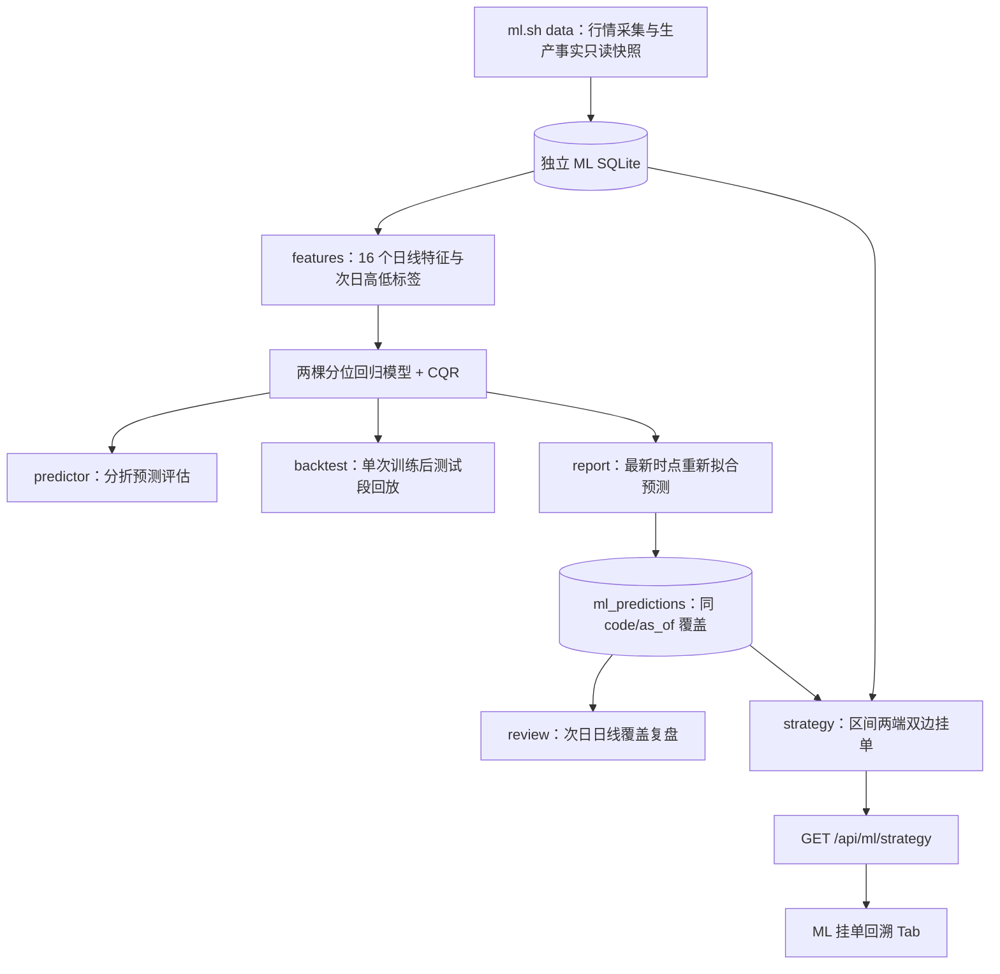
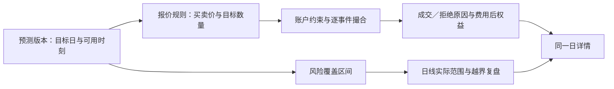

# myStock ML 准确性与「ML 挂单回溯」联动升级方案

> 文档身份：2026-09-04 · 原始作者 codex · 历史记录；2026-09-05 由 Codex 治理文件名与引用。作者／日期依据及旧名见文档清单。 [索引](../README.md) · [清单](../catalog.json)

> **状态导航（2026-09-05）**：以下保留原阶段的方案／记录，文中的“当前”、隔离目录、端口及未部署状态均按当时理解。四批工程现已合入 main 并部署，模型未晋级；当前使用与恢复见 [工程交接](../records/ml-upgrade-handoff_codex_20260904.md)，验收见 [部署回执](../records/ml-deployment_codex_20260905.md)，全部资料见 [文档索引](../README.md)。

> 作者：Codex · 调研／更新日期：2026-09-04（America/Los_Angeles）· 版本：v1.4
>
> 状态：只读调研后的实施提案，尚未实施模型或业务改动。
> 执行交接：用户已授权实施，见 [明确执行工单](../records/ml-upgrade-work-order_codex_20260904.md)及 [已验证的升级前备份](../records/ml-pre-upgrade-backup_codex_20260904.md)；工程在隔离任务中进行，本方案中的候选结果仍须实际验证，当前生产运行未切换。
> 代码基准：`beefd0c`（2026-09-03）；v1.0 首次调研开始时 Git 工作区干净。
> 历次数据库调研通过 SQLite `mode=ro` 读取，统计连接另设 `query_only=ON`；未抓取行情、重训生产模型、回填预测、生成／发布业务报告或操作交易。v1.3 同步更新 README 与讨论稿的导航链接，按用户要求提交并推送文档。
>
> v1.1：参考用户提供的 [Claude 方案 v0.1](ml-upgrade-plan_claude_20260904.md)，加入波动率缩放基准、多日库存状态机、触价后收益诊断与真实挂单对照，并修正标签合成、校准及策略验证中的若干边界。Claude scratchpad 数字作为参考证据，未在本轮独立复现；不改动其原文。
>
> v1.2：补齐用户确认的业务目标、背景与待定执行口径；明确旧数据复用／新版历史重算协议；核查 Futu 官方文档、yfinance 项目文档和本地 SDK，新增特征路线与可用时间约束。文件从 `ML_CODEX_UPGRADE_PLAN.md` 改为带日期名称；同日小版本继续在本文件迭代，后续跨日讨论可另存日期快照。此次仍只修改文档，未调用行情接口或升级依赖。
>
> v1.3：逐条参考 [Claude 合并讨论稿](ml-upgrade-merged_claude_20260904.md)，核查基准 `7e24fe7` 的相关源码。采纳四批交付、首期缩减建表／接口、固定策略先落地；修正四列版本化、只读边界、交易单位证据及 holdout 口径。取舍见 §2.4，更新后的首期范围见 §8–9。合并稿仍是讨论输入，本次更新不代表用户已批准模型／业务实施。
>
> v1.4：参考合并稿 v0.2（`1d79dd6`）和 v0.2.1（`9720a94`），独立核对三份本地 HTML 预测、当前日线／预测记录及采集／预测代码。新增 F16/P0 收盘与发布时间守卫，近期按人工触发设计；已入库实验脚本仅静态审阅，未执行训练。最新共识与实现边界见 §2.5、§5.1；仍仅更新方案与文档链接。

## 0. 项目背景、核心目标与讨论口径

### 0.1 项目优化背景

myStock 已有美股／港股行情、个人交易记录与 Web 展示，并建立了独立的 ML 数据库、次日高低分位预测和「ML 挂单回溯」。当前关注 6 只股票：NVDA、TSLA、PDD、腾讯、阿里、小米。这里的任务是优化既有系统，为人类制定次日交易价格提供依据；业务边界不是扩大选股池或接入自动实盘交易。

现有预测主要学习次日最高／最低相对当日收盘的收益率，再使用 CQR 扩展覆盖区间。现有回溯则在区间两端模拟买卖。这使同一对数字承担了两个不同任务：预测全天价格包络，以及寻找有收益的交易位置。较宽的包络可能提升覆盖，却减少交易机会；即使触达买价，价格仍可能持续下跌。因此需要把**预测准确性、交易可执行性、周期收益**分开验证，再在产品中连接起来。

已有资产包括约 5 年日线、约 3 年累积小时线、现有预测留档、交易记录和低成本的树模型管线。优先用这些资产建立可信对照。当前预测留档短、部分历史缺口被页面过滤、账户假设不统一，意味着单纯添加特征或更换算法还不能可靠回答“升级后是否赚得更多”。§4–5 记录具体证据，Claude 方案及其实验的可吸收部分见 §2.3。

### 0.2 用户已确认的核心目标

**利用 ML 预测几只指定股票下一个交易日的低价／高价，指导人类在价格低于低价时买入、高于高价时卖出，使一段时间周期内的交易收益尽量更大。**

这包含三个交付层次：

1. **预测层**：在明确的数据截止时点，给出下一个目标市场交易日的高低分布信息及不确定性，而非没有可信度说明的两个点。
2. **决策层**：从预测中生成可解释的买入阈值和卖出阈值，由人类结合现金、已有持仓与风险偏好决定是否执行。阈值可以与“风险覆盖区间”不同，但必须显示来源和版本。
3. **复盘层**：「ML 挂单回溯」同时展示预测与真实高低、阈值触达、模拟成交及账户权益变化；有真实委托事实时再对照实际操作。最终以共同资金与风险约束下的周期费用后表现判断价值。

默认研究流程建议为 T 日常规交易时段收盘后生成 T+1 的计划；若改为次日盘前更新，则另建预测截止时点与版本。后一个版本能看到的盘前消息／跨市场行情更多，不能与前一版本混算成绩。这里的生成时点是**待确认的研究默认值**，不是用户已确定的交易要求。

v0.2.1 已记录用户决定：**近期人工触发 `scripts/update.sh / scripts/ml.sh`，自动调度以后再议**。本方案据此设计任意手工运行时刻的守卫，不新建 cron／launchd。人工触发不意味着可以用未收盘数据预测：当前处于目标市场交易 session 内时跳过该市场的新预测，其他市场独立判断；准确的数据截止、目标日和可用时刻仍须逐条记录。

### 0.3 成功标准：预测服务于周期权益

主目标建议采用无外部出入金场景下的 `期末权益 / 期初权益 - 1`，权益包含现金和未平仓股票的市值，并正确处理费用、分红与拆股。并列报告最大回撤、最大资金占用、持仓时间、换手和未平仓风险；有外部资金流时另定可比收益口径。USD、HKD 分开计算，若汇总则必须明确历史汇率及折算时点。

比较对象包括：相同初始资产的买入持有／保持原持仓、简单波动率报价、冻结的现有预测与策略，以及升级候选。不能只统计已经盈利卖出的回合、忽略期末浮亏；不能把卖出回笼现金当利润；不能通过增加本金或暴露提高收益后宣称模型更准。预测 pinball、分侧覆盖与概率可靠性属于诊断指标，触达率也不能单独作为最终优化目标。

§6.4 的 5%／3% 等预测验收门槛、§7 的账户约束和 shadow 长度均为**建议的实验协议**。它们尚未成为收益结论；策略风险预算和可接受回撤仍需多方讨论后冻结。

### 0.4 建模主张与尚待讨论的执行细节

建议继续以小型树模型为主，逐步比较“波动率标准化的 next-day low/high 多分位预测＋独立校准”，而非立即切换复杂网络。多分位描述不同报价的触达机会，资金与库存规则决定哪些报价适合执行；进一步的触价后收益模型以足够成熟样本为前提。具体算法、边际概率不能相乘及跳空合成限制见 §6.3–6.5。

| 讨论项 | 当前理解／建议 | 尚未确定的边界 |
| --- | --- | --- |
| 标的与市场 | 先用当前 6 股，各市场独立日历与币种 | 是否调整标的池，不在本轮默认范围 |
| 下单方式 | 人类参考低买高卖阈值 | 预先挂限价单，还是触发提醒后手动下单；后者需计反应延迟，不能视为阈值处必成交 |
| 生效时段 | 初版建议常规交易时段、当日有效 | 是否含盘前／盘后，是否允许盘中更新或撤改单 |
| 数量与仓位 | 默认不裸空；买入受现金限制、卖出受可售库存限制 | 本金、初始库存、每笔数量、单股／组合上限；卖出后是否保留底仓 |
| 跨日管理 | 候选允许未平仓库存延续到后续交易日 | 最长持有、止损、时间退出、是否每天重新计算退出价 |
| 优化周期 | 同时观察日级预测和多周／多月权益 | 实际目标周期、风险预算及各股资金分配 |
| 不交易 | 保留无可用预测／不满足账户条件／无已验证优势时不交易 | 置信度或预期收益过滤阈值需在开发集选定 |

日线 low/high 只能说明是否穿过阈值，不能还原先买后卖的顺序、排队与实际成交。小时线可提高路径分辨率，但同一小时内双边触达仍有歧义。回溯必须标注假设与数据粒度，不能把模拟解释成人类已实现收益。

## 1. 建议决策

本次升级应沿着 **可信的预测留档与评估 → 小模型准确性实验 → 有约束的挂单模拟 → 页面联动与解释** 推进。保留 LightGBM 分位数回归和 CQR，不优先引入深度模型、完整 Qlib 框架或新的 RL 算法。

最关键的产品调整是：**“风险覆盖区间”与“挂单价格”成为两个分别评估、可以追溯关联的输出。** 当前模型把次日高低都包进区间视为成功，而挂单在低于下沿／高于上沿时才容易触发；提升覆盖率并不等于提升成交能力或净收益。不能通过无止境扩大区间宣称准确性提高，也不能靠放宽资金与库存假设宣称策略更好。

本轮发现的直接依据：

- 当前 6 只股票最近 30 个可用预测日，**每只双边成交均为 0 天**，完全未成交为 18–26 天。
- 预测总留档 294 条，其中 `live` 仅 69 条；按当前复盘口径已结算的 live 每股仅 10–11 条。线上长期有效性尚缺证据。
- 日线存在但预测缺失：美股每只 5 天、港股每只 4 天；页面先删去缺失日再取 30 条，显示的“30 个交易日”实际上是 30 个可用样本。
- 报告、离线预测评估、Web 回溯使用不同的模型训练／账户协议，不能直接横向比较其命中率和盈亏。
- Web 回溯复用了无约束的双边成交计算，未使用已有 `Account` 的资金与库存约束；并且其入口仍能取得可写 ML 连接。

建议第一批交付优先覆盖 **留档可追溯、固定窗口不吞缺口、只读连接、预测／挂单分开展示、默认不裸空**。模型实验随后使用相同数据和决策时点验证；若候选模型未通过验收，仍可交付这些可用性改进。

**v1.1 调整**：将 `naive_vol`（波动率缩放的经验分位）升级为必须战胜的简单基准；在受约束引擎上优先试验“买入后跨日管理库存”的策略；页面先提供“下一目标交易日预测与模拟报价”入口。触价后收益先做诊断与样本量审查，不让额外收益模型成为可用性交付的依赖。

**v1.2 调整**：历史数据继续复用，新版预测按历史截止逐期重训生成，保留旧预测原貌；外部特征按可回溯性分批接入。先试已有波动信息、指数背景和已存资金流，再验证财报窗口；Futu 新增的标的级历史 IV 值得优先探测，但需核实 SDK／OpenD、账户权限、历史覆盖与发布时间。详细协议及来源见 §13–14。

**v1.3 当前交付范围**：先修可用性，再完成最小不可覆盖留档与基线，随后做小模型实验，最后交付固定规则的库存回溯与页面。首期只新增一张预测版本表，其他元数据先用离线 manifest／配置承载；新增 API 缩为 latest／review／compare。外部特征保留研究优先级，暂不成为核心交付依赖；已有资金流可安排低成本独立消融，无须机械等待积累满两年。

**v1.4 优先级调整**：第一批先做“盘中跳过＋已收盘且数据确认的输入守卫＋按市场发布检查”。只过滤当前未收盘行还不够：此前已入库的盘中行可能在收盘后仍留在缓存，未完成的日线还会污染前一天的 next-day 训练标签。生成前必须先按截止验证整段输入，再构造特征／标签。自动调度暂缓，版本表仍在第二批，但拒绝／跳过原因与旧错误报告的证据保留不能等第二批才考虑。

## 2. 调研范围与证据强度

### 2.1 已完成

1. 阅读项目约定、README，以及既有 `ML_PLAN`、`ML_OVERVIEW`、`ML_ALGORITHM_PROPOSAL`、`ML_QLIB_BORROW_PLAN`、`ML_TIER1_ROBUSTNESS` 中有关架构、实验和历史决策的内容。
2. 静态追踪采集、特征、训练、CQR、CV、预测留档、复盘、撮合、回测、报告、Flask API 和原生 JS 页面。
3. 只读统计本地 ML 库：数据范围、预测来源与缺口、数据基本质量；复用现有纯读计算，统计覆盖与触达结果。
4. 在现有 `mk` 环境执行 9 个相关 ML 测试文件中的非训练用例：**109 passed，1 deselected，1.56 秒**。
5. 核对 CQR／自适应校准论文、当前本地版本的 LightGBM 官方参数文档，以及富途／HKEX 的交易单位资料。外部依据见第 12 节。
6. v1.2 只读核查生产库资金流与当前 profiles；阅读 Futu v10.10 官方接口文档、yfinance 项目文档及本机 `futu-api 10.7.6708 / yfinance 1.4.1` 的实现。未连接 OpenD 验证账号权限，也未请求外部行情，接口字段存在不等于当前账户可用。

### 2.2 结论边界

- **代码事实**：指可以直接定位到当前源文件的行为。
- **本地观察**：指当前库的只读统计，不能外推未来收益；`live` 是现有来源字段，不等于已验证在下单截止前发布。
- **待验证假设**：指有合理机制、尚未在本项目执行对照实验的改进。
- 本轮未训练候选模型，未完整重跑离线 RL／历史策略实验，未浏览器截图验收；页面建议来自代码及接口结构检查，不宣称已完成视觉或移动端实测。
- 本地数据文件的数据库内容可能随用户原有作业变化，本次统计是调研时观察值，不是冻结的实验数据集。
- 本文仅记录行情／模型的汇总质量指标，不复制个人交易明细、账户资产、订单标识或配置秘密。

### 2.3 参考 Claude 后的取舍与新增认识

Claude 的主要贡献是补充了简单模型对照和跨日回合分析，使“先修评估、再做波动信号、最后验证执行”的路线更具体。下表区分可以吸收的方向和仍需验证的结论：

| 参考内容 | 本方案处理 | 依据与限制 |
| --- | --- | --- |
| 实验 A：naive_vol 在 4/6 股票上比原 LightGBM 的 pinball 更低，差距约在 ±3% 内 | **采纳为优先复现的基准**，新增明确 skill 定义 | 来自 Claude §3.1；原脚本／快照未入库，本轮未独立训练复现，不能据此认定模型只学会了波动率 |
| 强正则＋额外特征有小幅改善 | **拆成独立消融** | 原实验同时改特征、树数和容量，不能单独归因“过拟合已证实”；vol_60d 会改变有效起点，必须统一样本 |
| 39/43 买入最终完成卖出、完成回合平均毛利为正 | **采纳多日库存策略为候选**，不采纳“已经成立”的定性 | 来自 Claude §3.3；未平仓损失、费用、重叠仓位和共享退出机会可能影响结果；4–7 天是各股均耗时，非所有回合的完成上限 |
| 触价与触价后收益分开 | **采纳**，先输出事件后价格变化，再决定是否训练条件收益模型 | 当日／5 日结果需统一价格和标签成熟时点；稀少成交样本不能直接支撑高自由度模型 |
| 范围波动率、HAR 式日／周／月特征 | **采纳为 E5 特征组** | 作为候选测增量；不把理想价格过程下的估计效率解释成真实样本数增加 5 倍 |
| gap 与 intraday 分解、分侧 CQR | **修正后进入可选实验** | 收益需乘法复合、分位数不可直接相加；分侧校准需明确联合误覆盖预算 |
| 明日卡片、K 线联动、真实挂单对照 | **采纳**，优先展示下一目标 session 和生效状态 | 当前浮窗行情来自生产库，与 ML 价格版本可能不同；不能预先承诺只改前端即可 |
| 预计算逐日／逐回合结果 | **部分采纳**，只物化固定完整场景 | 库存路径有状态；不能从全历史结果随意截出 30 日作为“从零初始状态”的回溯 |

需要避免的进一步推断：

- 全来源 47–49 个已结算样本的覆盖率不是严格 live 覆盖率；与 walk-forward 的差异可能来自训练协议、样本时期和历史来源，不能全归因于静态 q。
- 观察到双边成交为零不代表物理上不可能；有库存上限也不保证收益为正或不再随窗口翻转。
- 将最后 120 日命名为 lockbox，不会消除已看过历史的事实；正式验收不能在每次改档后反复查看同一个锁箱。
- 一个计划执行时间不能证明每条预测都在目标市场截止前可用；需要逐条 `published_at_utc`、市场日历和作业状态证据。
- Claude 文档记录的 `167 passed` 是其测试结果。本方案的独立测试记录仍为 §10.1 的 109 项；本次文档迭代未新增业务测试或训练实验。

### 2.4 对 Claude 合并讨论稿的逐项反馈（v1.3）

采纳其“收缩首期、按四批形成闭环”的工程建议。下面是 Codex 本轮的修订判断，不将 Claude 的建议或单方实验重新标成三方已确认事实。

| 合并稿内容 | 处理 | 修订理由与落点 |
| --- | --- | --- |
| 四批交付；预测实验失败不阻塞策略／页面 | **采纳** | §9 改为四批＋独立 shadow；策略用冻结预测也可交付，预测升级与策略默认切换分别验收 |
| 七张表、六个新接口一次建齐过重 | **采纳缩减** | §8 首期一张不可覆盖预测表＋运行 manifest；仅 latest／review／compare，其他表和端点按实际需要再拆 |
| 旧预测表增加四列即足够版本化 | **不采纳此实现** | 原主键仍是 `(code, as_of)`，写入仍是 `INSERT OR REPLACE`；加列不能保住同日旧版本。`PRED_COLS` 还需同步，否则新字段不会写入；最小闭环须改变版本身份和写入语义 |
| strategy／backfill／Web 全链路只读 | **限定边界后采纳** | Web 与纯查询连接只读；离线 backfill／report 本来负责写入独立 ML 库。回填读取行情需透传 db_path，写预测使用离线写入口，生产库继续只读 |
| 从成交数量推断小米 board lot，其他港股默认 100 | **不作为规则来源** | 成交量可为多手、部分成交或碎股，不能证明交易单位。按官方证券资料／Futu 元数据核实；交易单位、策略每笔股数分别配置，不在公开文档复制个人持仓明细 |
| 最近 120 session 作工程 holdout | **仅作为开发评估窗口** | 已被查看／分析过的数据不是未见锁箱；“7 月前改档”不证明整个滚动 120 日窗口都在改档后或从未用于选择。用明确起止日期和实验登记说明用途，保留前向 shadow |
| 实验 A 必须复现到 ±0.0001；五种子评估 | **附条件采纳** | 先取得原脚本、快照、分位与切分配置；否则只能重建实验，不能承诺复现某个小数精度。种子 std 衡量训练随机性，不替代跨时间分块的不确定性 |
| E1→E2→E3→E5→E4；E6–E8 后置 | **采纳** | 先比较 raw 预测机制与特征，再比较校准；多分位／池化为扩展，不塞入固定短工期 |
| 跳空误差占比 >40% 才建模 | **保留归因，不固定阈值** | 占比依赖损失定义与分解方法，40% 目前没有项目证据。先定义可重复归因，再判断联合建模是否能通过同一增益门槛 |
| capital_flow 积累满两年再评估 | **保留短历史限制，不设两年硬门槛** | 约一年可以做少量特征的探索性共同窗口实验；证据不足就记录负结果／继续积累，不能用短期成绩直接批准上线 |
| Futu 新特征多数本地无方法 | **按接口分别判断** | 标的级 IV／统计和日历方法缺失；日卖空、回购、单合约 IV、财报窗口方法已有。是否暂缓按接入与历史证据成本，不混淆 SDK 缺失和数据不足 |
| 沿用现网收盘后批次，盘前更新另议 | **作为实施候选** | 计划触发时间、实际完成时间和每个市场可用截止不同；先核实 cron 时区／星期覆盖／完成日志，使用 IANA 时区处理冬夏令时，不能只凭“02:40 PDT”断言全部日子及时 |
| 覆盖率与成交是相反目标；1h 吻合率足够 | **弱化绝对表述** | 当挂价绑定边界、区间向外扩展时，触达机会通常下降；分开输出后不必然对立。历史匹配率不保证新库存策略的路径准确性，1h 先用但保留同 bar 歧义 |

版本化核查依据：[`schema.sql`](../../mystock/ml/schema.sql) 的复合主键，以及 [`db.py`](../../mystock/ml/db.py) 的 `upsert / PRED_COLS / upsert_predictions`。SQLite 的 REPLACE 会在唯一键冲突时移除旧行后插入新行；并非追加一个预测版本。[SQLite 官方冲突处理说明](https://www.sqlite.org/lang_conflict.html)

合并稿的“双方均核实”需继续按数据来源和窗口区分：本方案 v1.0 双边触达的独立统计是最近 30 个可用预测日，不能据此认领 47–49 日全窗口也独立核实；模型对照与跨日毛利仍按 Claude 实验归属，参见 §2.3。后续先把实验固化成可运行资产，再形成共同证据。

### 2.5 合并稿 v0.2／v0.2.1 后的共识与补充（v1.4）

双方已收敛到：一张不可覆盖版本表＋manifest、Web 只读而离线写入保留、交易单位与策略数量分离、开发评估窗口与前向验证分开、固定库存规则先交付、外部特征不阻塞核心、资金流无需等待两年。§2.4 保留上一轮讨论经过，最新实施建议以本节及 §5.1、§8–9 为准。

**新 P0 已有具体证据**：本轮从 2026-08-17、08-27、09-01 三份本地报告中只提取预测价与生成时间，和只读 ML 库对照。报告分别含腾讯 08-18「收盘 439.00」、NVDA 08-27「收盘 226.00」、腾讯 09-02「收盘 435.20」；当前对应日线为 442.40、227.98、438.20，预测表同键已存后续生成的版本。结合报告的盘中生成时刻与源码缺少收盘判断，支持 Claude 关于盘中输入和覆盖风险的判断。

这里独立核实的是**本地留存报告／当前库／代码**，未检查公网服务器上的历史发布版本，也未独立枚举所有调度器；“没有自动任务”的机器核查仍归属 Claude。不能仅凭价格不一致把所有历史差异都归为盘中输入。此前 F02/F03/F10 和验证矩阵已列出覆盖、最终确认与截止风险，本次具体案例把它们升级为需要优先处理的实际问题。

**新入库的实验资产**：已静态阅读 [实验说明](../../scripts/ml_experiments/README.md)、[实验 A](../../scripts/ml_experiments/exp_a_baseline.py)、[实验 B](../../scripts/ml_experiments/exp_b_touch_economics.py)。脚本可作为重建起点，原始输入快照／环境与当前库仍需区分；本轮没有运行脚本，不新增数值复现声明。

- A 已对各候选使用包含额外特征的共同样本掩码，分位实际来自 `config.alpha_for`；不能按文件头把所有股票解释为固定 0.2/0.8。朴素尺度缺少零／非有限保护、CV 尾部和折均值口径沿用旧实现，强正则组同时改了特征。原样重建与修正后的正式基准须分别命名、记录差异。
- B 读取时使用可写连接，运行时应先改为只读／显式数据上下文；脚本不做受约束账户回放。`min(i+5, last)` 会把末尾不足期限的结果当“五日”输出，而且买入日是 i+1，该索引对应的持有期限需重新命名或对齐。未来正式评估须将未成熟标签标为 pending；逐笔独立寻找退出仍不能直接证明组合收益。
- `lot_size` 从已有 Futu 快照采集补齐的方向可用，但落库字段、采集映射、ML 只读快照与规则读取需一起接通；只给生产 profiles 加列并不会自动进入 ML。当前元数据不是历史生效规则，缺失回退须显式标近似。

合并稿早期 §0／§3 等仍保留旧措辞（四列版本化、两年门槛等），不能覆盖其 §7 的最新回应。剩余业务参数包括本金／数量／库存上限／费用；E6 默认后置。这些参数不阻塞第一批正确性修复，但本轮不据讨论稿自动开始实施。

## 3. 当前系统实际链路



| 部分 | 当前实现与能力 | 应保留的资产 |
| --- | --- | --- |
| 数据 | 日线、1h、交易快照独立 ML 库；增量抓取日线和小时线各自判断缺口 | 与生产库隔离、行情可离线使用 |
| 特征 | 16 个收益率、波动率、ATR、价格结构、均线偏离、量比特征 | 纯函数，T 收盘信息预测 T+1 |
| 模型 | 每股 high／low 两个分位模型；LightGBM 优先，sklearn 回退 | 样本规模适配、CPU 即可运行 |
| 校准 | 训练尾部 25% 留作校准，fit/cal 间隔 1 行；CQR 联合高低覆盖 | 已有分位得分、校准与 NaN 测试 |
| 评估 | 预测层分折、22 行保守隔离；覆盖率、pinball、MAE、宽度 IC | 时间顺序、不随机打散、两级评估意识 |
| 留档 | `live / backfill / recomputed`；主键 `(code, as_of)` | 已有来源标识和历史复盘入口 |
| 撮合 | 1h 首次触达；买 `min(limit, open)`，卖 `max(limit, open)` | 单笔限价撮合、跳空处理、基础 Account |
| 页面 | 标的、回溯天数、逐日明细、净持仓漂移、按币种汇总 | 原生 JS、离线查询、红涨绿跌、本币不混加 |

注意：`backtest.py` 使用 `Account` 且默认初始现金 20,000、数量单位 5 股；`strategy.py` 用从 0 开始的现金流／净持仓累积，US 每次 10 股、HK 每次 100 股，允许负仓位。两者共享单笔撮合函数，但**不是同一个账户回放引擎**。

## 4. 本地数据与准确性现状

### 4.1 数据库存量

| 市场 | 标的数 | 每股日线 | 日线范围 | 每股 1h 行数 | 1h 范围 |
| --- | --- | --- | --- | --- | --- |
| US | 3 | 1,307 | 2021-06-22 至 2026-09-03 | 5,446 | 2023-07-25 至 2026-09-03 |
| HK | 3 | 1,279 | 2021-06-23 至 2026-09-04 | 5,424–5,427 | 2023-06-30 至 2026-09-04 |

采集参数仍是 `5y / 730d`，但本地 UPSERT 累积后的时间跨度可以更长，不能把抓取参数当作当前数据库有效覆盖范围，更不能只看首尾日期认定中间完整。

本次基础检查：日线缺 `adj_close` 为 0；日线高低与开收关系异常为 0；预测空边界／非正下沿／上下沿倒置为 0。发现拆股与分红事件存在，后续需要专门验证价格口径与账户事件处理。

对重叠交易日，比较日线 high/low 与小时线聚合 high/low，任一相对差异超过 1% 的历史天数：NVDA 10/782、TSLA 8/782、PDD 7/782、腾讯 92/781、阿里 119/781、小米 51/781。**2026-06-22 起该检查均为 0**。历史差异是数据核查线索，不能据此直接判定复权错误，也不能推断最近 30 日撮合已受其影响。需区分小时缺失、会话范围、供应商修订及价格尺度。

### 4.2 留档与复盘口径

| 市场／每股 | live | backfill | recomputed | 已结算 live | 预测起点以后、日线有而预测缺失 |
| --- | --- | --- | --- | --- | --- |
| US | 11 | 23 | 14 | 10 | 5 天 |
| HK | 12 | 22 | 16 | 11 | 4 天 |

总计 294 条预测；135 条历史 HTML 回填缺少 CQR／backend 等参数。US 缺口为 08-18、08-19、08-20、08-21、08-26；HK 缺口为 08-19、08-20、08-21、08-24，均指 2026 年基准日。对应近期日线均有至少一根小时线，说明这些预测缺口不能简单归因为小时行情完全缺失。

旧 README 中“交易日无缺口”已不适用于当前库。后续应由自动完整性统计替代静态承诺。

下表使用现有 `review_predictions` 与 `run_strategy(days=30)`，保留原口径，不是新算法成绩：

| 标的 | 全来源已结算覆盖率（样本数） | live 覆盖率（样本数） | 最近 30 个可用样本覆盖率 | 最近 30 平均区间宽／基准收盘 | 买成／卖成／双边／都未成天数 |
| --- | --- | --- | --- | --- | --- |
| US.NVDA | 51.1%（47） | 70.0%（10） | 60.0% | 6.58% | 6 / 6 / 0 / 18 |
| US.TSLA | 78.7%（47） | 80.0%（10） | 86.7% | 8.92% | 1 / 3 / 0 / 26 |
| US.PDD | 76.6%（47） | 100.0%（10） | 83.3% | 5.87% | 3 / 2 / 0 / 25 |
| HK.00700 | 55.1%（49） | 81.8%（11） | 70.0% | 5.87% | 5 / 4 / 0 / 21 |
| HK.09988 | 73.5%（49） | 72.7%（11） | 73.3% | 8.10% | 3 / 5 / 0 / 22 |
| HK.01810 | 53.1%（49） | 54.5%（11） | 66.7% | 8.29% | 5 / 5 / 0 / 20 |

US 回溯实际窗口为 07-17 至 09-03，HK 为 07-21 至 09-04。live 只有 10–11 个已结算样本，PDD 的 100% 不能解读成稳定精确；也不能据此把某只股票判为已达标。各来源生成协议与市场时期不同，不宜将来源间的指标差直接解释为模型进步。

当前代码缺少正式收盘／数据最终确认字段，因此上面的“已结算”只代表现有代码找到了下一条日线，不代表本轮额外验证过每个交易时段最终完成。

## 5. 关键问题与优先级

以下行号基于调研代码版本，后续改动可能移动；以函数名定位为准。

| ID / 优先级 | 证据位置 | 已确认行为及影响 | 改进方向 |
| --- | --- | --- | --- |
| F01 / P0 | `predictor.py:199`；`strategy.py:99` | 覆盖目标与边界触达挂单存在结构性冲突；本地最近样本无双边成交 | 风险区间和执行报价分层；覆盖与成交分开验收 |
| F02 / P0 | `schema.sql:98` 起预测表；`db.py:47,68`；`report.py:540` | 相同 code/as_of 用 REPLACE，历史版本可被重跑覆盖；无 model_id、目标日、输入快照和可用时刻 | 不可覆盖的预测版本、明确目标 session 与 published_at |
| F03 / P0 | `strategy.py:84`；`review.py:35` | 先过滤有预测／有小时线的日期再截窗；“下一根日线”不能区分停牌与采集漏日；任意非空 bars 被当可结算 | 交易日历定义窗口，逐日保留缺失／未完成状态 |
| F04 / P0 | `strategy.py:91–139`；`simulator.py:57` | 双边独立撮合、净持仓可负、无初始本金；缺费用和盘中现金约束 | 共享账户事件引擎，默认现金账户／不做空 |
| F05 / P0 | `strategy.py:73,294`；`db.py:19`；`web/app.py:251–270` | Web 入口间接获取可写 SQLite 连接；当前没看到写 SQL，但不具备数据库级只读保证 | Web 全链路 `mode=ro`，同一请求读同一快照 |
| F06 / P1 | `predictor.py:144,243`；`backtest.py:94–113`；`report.py:532–562` | 分折模型、单次训练后整段回放模型、最新时点重训模型混在不同展示中 | 统一 rolling-origin runner 和运行配置；展示关联同一预测版本 |
| F07 / P1 | `predictor.py:95–114` | 训练末尾 25% 留作校准；在约 1,250 有效行上，基础模型会失去约 300 个最近样本；校准 q 在测试折内冻结 | 固定长度近窗校准、定期重训和逐日残差校准的对照实验 |
| F08 / P1 | `predictor.py:54–57`；`cv.py:50–66` | LightGBM 设置 subsample=.8 但 subsample_freq 默认为 0；CV 整除可能漏末尾余数 | 明确启用或关闭 bagging；最后测试折覆盖末尾；记录时间范围 |
| F09 / P1 | `predictor.py:207–231`；`calibrator.py:1–17,44` | 用 CQR 调整后的边界计算原 alpha 的 pinball／MAE；CQR 注释将有条件的覆盖保证泛化；小样本高目标分位被 clamp | raw quantile 和校准区间分开评分；补可交换性及样本不足边界说明 |
| F10 / P1 | `fetch.py:174–186,254–285`；`scripts/ml.sh:59` 起 | OHLC 检查不拒绝 inf／高低关系错误；空抓取可记 ok；失败后继续且脚本最终 echo 可掩盖失败／发布旧报告 | 数据质量状态、失败退出码、可发布结果清单及原子 latest |
| F11 / P1 | `strategy.py:52,122–128,247` | 固定 HK 100 股；仅日终现金最低点被称“实际垫付”；组合累加单股峰值并取最长样本天数 | 实际交易单位与报价档位；按事件计算资金；组合对齐日期后聚合 |
| F12 / P1 | `calibrate.py:29–36`；`backtest.py:190–197` | 真实订单／成交取日期后用全天 bars 回放，未限定下单／取消时刻 | 不能沿用旧吻合率证明精度；重做具备订单生效时窗的撮合校准 |
| F13 / P1 | `web/app.py:258–267`；`app.js:1547–1712` | 无来源、模型、健康度、未成交原因；输入无效代码会静默回退默认；重复代码未去重 | 明确校验、可追溯逐日联动、状态解释、查询持久化 |
| F14 / P2 | `backtest.py:179–186` | 动作前后都按次日 mark 估值，reward 只记录当天交易相对收盘的边际变化，却减去完整 buy_hold 日变化 | 单独定义交易优势 reward 或完整账户日收益；新增手算样例后再评估 bandit |
| F15 / P2 | `backfill.py:132`；`data.py:29–58` | recompute_gaps 接收 db_path 但 load_daily 未透传；读行情以是否含点判断代码类型，带点的 yf 符号有歧义 | 明确数据上下文和 symbol/code 类型，避免实验读写串库 |
| F16 / P0（v1.4） | `fetch.fetch_daily / fetch_hourly`；`predictor.predict_next_day`；`report.build_report`；三份本地报告对照 | 采集未按 session 完成状态过滤，预测直接用最后一个特征完整行；盘中价可被标为收盘，还可进入前一天的训练标签；后续 REPLACE 隐去旧版本 | 盘中按市场跳过、采集／预测双层守卫、输入最终确认、截止前发布检查；拒绝原因与历史证据留存 |

补充说明：

- F08 已本地确认 `LGBMRegressor(subsample=.8).get_params()['subsample_freq'] == 0`。官方 4.6.0 参数定义也说明 0 禁用 bagging；这不代表启用后必然提高准确率。[LightGBM 参数文档](https://lightgbm.readthedocs.io/en/v4.6.0/Parameters.html#bagging_freq)
- CV 本地纯索引示例：`n=1286, n_folds=4` 时，最后测试索引是 1283，末尾 1284–1285 未覆盖。修复后要同时保留旧协议结果，避免误把样本变化当算法效果。
- F09：MAE 衡量分位端点偏差可以作为诊断，但 MAE 的最优点是条件中位数；不能单用 MAE 选择尾部分位模型。负 q 允许收紧，仍需逐行检查校准后 `L <= H`；本地现有预测未发现倒置。
- F11：“各股峰值之和”可保留为原有描述指标，但不等于共享现金池的真实组合峰值，也不能把期末为零仓位理解为盘中不需资金。
- F14 不表示 bandit 在选择动作时读了未来特征：`select` 使用当日 x；问题是学习目标和持仓收益归属不一致，应准确区分。
- 历史 CQR／IC／purged 组件确已存在，不能把旧提案中的代码草图再包装为待新增功能。历史 HMM／风险 reward 失败记录继续保留。

### 5.1 第一批必须加入的时间与发布守卫

近期维持人工触发，不配置自动调度。守卫属于离线采集／预测／发布链路；Web 只读取相同状态结果，不另算一套市场时间。建议以可注入 `now_utc`、市场日历和输入事实的纯函数集中判断，避免脚本入口有检查而直接调用 `predict_next_day` 又绕过。

| 场景 | 初版应有行为 |
| --- | --- |
| 某市场当天 session 尚在进行 | 该市场跳过新预测，记录 `skipped_in_session`；午休不等于当天已收盘，另一市场独立继续；保留旧留档并标清其目标日／是否过期 |
| 最新日线／小时线尚未结束 | 未完成日线不进入 ML 的最终行情集合；小时 bar 按实际结束时刻判断，不能把起始时间当完成。原始暂存如需保留必须与最终集合隔离 |
| 现在已收盘，但库内仍是早先抓到的盘中行 | 不能仅凭当前时钟把它升级为 finalized；要求该 session 收盘后的采集／确认依据，缺证据则 `awaiting_final_data`，请求人工先更新数据 |
| 后台日线延迟、半日市、假日、停牌 | 按版本化日历与实际数据状态处理；市场收盘时刻和供应商最终数据可用时刻分开，包含适用的收盘竞价及确认延迟；不能硬编码普通日钟点代替全部情形 |
| 直接 train，绕过 data 步骤 | 在 build_features／训练标签构造前验证并截取完整的已确认输入；当天不完整 high/low 不能作为前一天标签。现存 legacy 行缺确认信息时明确质量级别，不把历史重建结果混作 live |
| 训练完成时目标日已经开盘 | 发布前再次核对实际时间；记录 `missed_deadline`，不发布为本方案的盘前可用预测。不能不重算就把 target_session 顺延，也不能只用任务开始时间证明及时 |
| 一部分市场跳过或失败 | 新报告按市场显示本次状态和原预测的真实目标日；只纳入本次通过检查的预测。另一市场成功不使跳过市场变成“已更新” |
| 全部市场跳过／全部失败 | 不替换有效 latest、不重新推送旧报告冒充新结果；正常跳过有结构化原因，真正错误返回非零；日志与页面保留旧结果的新鲜度说明 |

收盘守卫负责**阻止无效预测作为正常信号产生／发布**，版本化负责**保留已经产生过的事实**，不能以“未来会留档”代替输入阻断。第一批使用现有同步日志／运行结果记录跳过、拒绝和阶段状态；不为了记录事故刻意生成错误预测。第二批如需导入已存在的旧错误报告，标为 `legacy_invalid / in_progress_input` 等审计状态，保留原貌并排除出有效 live、默认校准和交易信号。

已有数据库中的后续正常版本与本地 HTML 错误版本需分别识别：先只读归档原报告和输入证据，再做版本化迁移。不要删报告、用当前收盘重写旧预测或伪造旧发布时间。此前按 source 统计的覆盖率可保留为历史口径，经过新质量筛选的结果应另起名称、显示排除原因和样本数。

首批验收至少覆盖：美股盘中／港股午休、一个市场开放另一个关闭、半日市／假期／冬夏令时、已收盘但旧盘中缓存未刷新、直接 train、训练跨过发布截止、部分／全市场跳过、步骤失败后不误发布，以及修改未完成 bar 不改变已确认训练样本。只用合成行情和可注入时钟验证，不以真实等待开收盘作为测试。

## 6. 准确性升级：先定义怎么证明，再做实验

### 6.1 定义三类指标

**A. 分位预测本身**：对未校准的 low/high quantile 分别计算 pinball loss；多分位输出时计算固定 alpha 网格的平均 pinball。所有损失先用 T 收盘归一，再按股票等权汇总，避免高价格标的主导结论。MAE、width IC 作为辅助诊断。

新增 `skill_side = 1 - loss(model_side) / loss(naive_vol_side)`，分别报告 low/high；正值表示优于波动率基准。基准损失为零或样本不足时返回 unavailable。同时列现有 champion 的相对变化，避免只比一个弱基线；不把两端的少量分位 pinball 称为完整 CRPS。

**B. 风险区间质量**：联合覆盖率、上下侧越界率、平均／P90 区间宽、越界幅度、滚动覆盖误差，均保留样本数和来源。CQR 后边界不是原 alpha 的原始分位估计，单独评估其覆盖／宽度，不混成一个“准确率”。对 high/low 联合包络若使用自定义越界惩罚分数，要明确公式与权重，不能未经论证套用单一标量标签的标准 interval score 保证。

**C. 执行可用性**：买／卖触达率、有效下单率、实际模拟成交率、双边成交率、费用后权益、回撤、仓位暴露、拒绝原因、持仓时间、相对基线表现。1h 的触达不是已验证的真实成交概率；缺失或不完整行情不能计作未成交。

### 6.2 统一实验协议

新增轻量 `evaluation.py`／`experiments.py`，复用现有模型、校准、指标组件，不引入大型框架。

1. 固定 experiment manifest：代码 SHA、依赖版本、特征顺序、超参、种子、市场日历版本、数据快照哈希、训练／校准／测试范围和生成策略。
2. 外层使用至少 6 个不重叠或明确标注重叠的时间测试段，建议每段 60 个市场 session；先做覆盖可行性清单。预测实验可用日线全史，执行实验只用合格小时线范围；不要为了执行数据范围而丢掉预测训练历史。
3. 内层按时间选择窗口／超参，目标日标签的实际可用时刻必须早于模型训练截止。测试段内固定每日预测流程，例如每 20 个 session 重训基础模型、每天更新已实现残差；离线回放严格复刻这个频率。
4. 现有 22 行 purge 保留作保守对照。真正防前看要检查 `label_available_at <= decision_at`，并剔除实际标签区间重叠；特征回看本身不意味着有未来信息。不得用加大 purge 代替锁箱。
5. 校准样本必须来自未被对应基础模型训练过的预测。模型一旦重训，不能不加说明地把不同模型的残差混用；固定验证切片或真实逐时点 OOF 残差轨迹，策略写入 manifest。
6. 每个候选用相同日期、输入快照和基线，建议固定 5 个种子（0–4）。市场／日期为共同分块单位进行配对 block bootstrap，保留跨标的相关性；不能把六只股票同日视为六个独立实验。
7. 最近 120 个 session 统一标为开发评估窗口，固定起止日期并登记已参与的实验／讨论。只有确认从未参与候选选择、预先封存的数据才可另称 holdout；当前已观察历史不满足该声明。正式上线证据需额外积累协议冻结后的前向 shadow 样本。
8. live、历史 HTML、重算三类独立报告；旧来源参数不明即标记 unknown。重算只能证明当前算法对当今历史快照的回放能力，不能恢复当年真实可用信息。
9. 新增长窗口特征的消融使用共同样本掩码、相同测试日期和相同基准；另报因此减少的数据量。5 日收益标签和最长 20 日退出策略按各自实际标签结束时刻管理边界，不能沿用 next-day 的 1 日标签假设。策略净值以完整因果路径评估，标签建模才要求对应持有期结果已成熟。
10. 锁箱一次开启后的结果只用于该冻结候选的验收；据结果修改参数即把该锁箱降为开发集，下一次正式验收依赖新前向数据。小样本／接近零 skill 时不用 `std/mean` 作稳定性阈值，使用绝对差、分块区间和各时期结果。

### 6.3 候选实验与顺序

下面全部是待验证候选，不承诺提升幅度。每轮只改一个机制，最多先跑 12 组内层配置；后续组合只使用已证明有效的组件。

| 组 | 对照／候选 | 机制与改动点 | 成本及风险 |
| --- | --- | --- | --- |
| E0 | 冻结现有 QR+CQR；**naive_vol**；滚动经验分位；ATR 尺度区间 | 新增 `baselines.py`；naive_vol 用训练集 `quantile(y/scale_T, alpha) × scale_test`，scale 默认为 vol_20d；设有限正尺度下限，禁止用测试标签定系数 | 低成本，必须先做；基准也有窗口／分位等设计选择，非无假设 |
| E1 | 全历史 vs 最近 504／756 session；固定校准 60／120 session | 测试长历史稀释近期模式、25% 校准使基础模型滞后的假设 | 低成本；小窗方差可能更大 |
| E2 | 原生目标 vs 用 T 时刻 ATR／vol 尺度标准化目标 | 降低高低波动时期损失尺度差异；用已知尺度还原价格与残差 | 低至中；尺度下限和异常事件需保护 |
| E3 | LightGBM 正则化、叶子／min_child_samples、bagging 显式配置 | 小样本控制容量；早停使用内层验证，不能用最终校准集反复选参 | 低至中；默认不开大规模搜索 |
| E4 | 固定 q vs 最近 OOF 残差滚动 q；其后才试 ACI | 让校准适应波动变化，逐日仅消费已结算标签 | 中；时变覆盖不等于每一天条件覆盖 |
| E5 | 短长波动比、下行波动、范围波动率、HAR 式小时收益平方和摘要、尾盘形态 | 先日线组，再小时组；冻结 feature v1/v2；用共同样本消融；细则见 §6.5 | 中；必须验证特征在 T 截止时可用 |
| E6 | low/high 多分位网格；可选每市场 pooled 与 per-stock 对照 | 风险区间和挂价有不同目标，输出条件分布信息；共享模型需同一时间切分 | 中至高；新增自由度，后置 |
| E7（可选） | 隔夜 gap 与日内范围分解 | 先作误差归因；有增量证据才研究联合分布合成，不直接相加分位 | 中至高；不纳入首批必交付 |
| E8（可选） | 分侧校准、触价概率与触价后收益 | 先离线诊断和概率可靠性，再按足够成熟样本立项 | 中至高；与默认回溯交付解耦 |

E4 的理论边界：标准 CQR 的有限样本覆盖依赖可交换性，价格序列不能自动满足。ACI 研究长期覆盖频率适应分布变化，不能被宣传为“明天有 70% 条件成功率”。[CQR 原论文](https://arxiv.org/abs/1905.03222)、[ACI 原论文](https://arxiv.org/abs/2106.00170)

核心消融顺序为 **E1→E2→E3→E5→E4**，每次只改变一个机制；E6–E8 为后续候选。E0 同时保留完全冻结的旧模型和显式配置 bagging 的对照，不能修完 `subsample_freq` 后仍把改变过的模型叫原基线。外部特征在共同评估协议可用后另立小实验，不要求内部特征 E5 必须先胜出，也不成为核心交付依赖。

美港市场的时区必须以 `available_at` 做 as-of join，例如香港收盘预测不能使用之后才完成的当日美股收盘。资金流数据可读已有生产快照，但历史较短、修订与公布时间需先核验；不得把当前 profiles 中的估值、交易单位或事件信息无日期地回填到历史。

本轮不优先：TFT／Transformer、LLM 股价预测、完整 Qlib 迁移、重新上 HMM／风险 reward、IQL／CQL。现有样本与证据更适合可解释小模型、数据质量和评估改造。

### 6.4 建议验收门槛

以下为实施前应冻结的工程目标，不是本轮实测成绩，也不是收益承诺：

开发集中的滚动验证用于筛选；最近 120 个 session 若已参与讨论或实验，就明确命名为“开发评估窗口”，冻结实际起止日期与实验查看记录，不能称为独立锁箱。下列历史门槛通过只说明候选值得进入前向验证。种子 0–4 的均值／标准差用于训练稳定性，配对时间分块区间用于历史表现不确定性；两者不能替代。

- 学习模型候选：相对冻结现有 champion 的等股票权重 raw pinball 改善至少 5%，同时相对 naive_vol 的 skill 至少 +3%；配对分块置信区间支持改善；至少 4/6 股票方向改善，无单股恶化超过 10%。两端分别报告，门槛先固定再试验。若朴素基准更优，可将其作为简化版 champion 候选：比较现有 champion 的损失／覆盖／宽度和前向表现，不要求它战胜自己；不得因复杂候选失败就未经验证自动切换。
- 风险区间候选：在目标覆盖率 70% 的固定协议下，覆盖率与目标的偏差建议不超过 ±5 个百分点，同时比较统计区间；在覆盖相当时，平均宽度相对冻结基线降低至少 5%，P90 宽度无明显恶化。覆盖显著不达标时，不接受仅靠缩宽得到的分数改善。
- 上下侧单独报告，不能用一侧长期过宽抵消另一侧长期漏判。各股／各时期样本不足时不强行宣称局部达标。
- 候选通过离线后，先运行至少 60 个目标市场 session 的前向 shadow；69 条现有 live 留档不替代此过程，旧样本无法补齐发布时刻的证据。
- 执行层必须另过费用后收益与风险门槛；预测器升级通过不自动授予新策略默认地位。

### 6.5 新增候选的实施细则与数学边界

**波动率特征分组**：先分别试范围估计量（Parkinson／Garman-Klass／Rogers-Satchell）、`vol_5/vol_20` 与 vol-of-vol；再试 1h 已完成 bars 的收益平方和及其 1／5／22 session 聚合。区分收益平方和（方差）与开方后的波动率，固定名称与量纲。这里借鉴 HAR 的多时间尺度结构，不宣称直接复现高频 HAR-RV 的精度。[Corsi, HAR 原论文](https://statmath.wu.ac.at/~hauser/LVs/FinEtricsQF/References/Corsi2009JFinEtrics_LMmodelRealizedVola.pdf)

小时特征须单独处理 overnight、US/HK 时段长度、午休及不满一小时的末 bar。只有 7 根 bars 不能等价于充足高频采样；少于 7 根也不能直接判成半日市，需日历／停牌状态核实。先校验价格序列与 bars 完整性，再输出 realized-variance proxy；缺失值不能用后一天补回。新增“距高／距低”先检查与已有 `close_pos_in_range / day_range_rel` 的代数冗余。

**跳空与日内分解**：若 `g=O(T+1)/C(T)-1`、`u=H(T+1)/O(T+1)-1`，则

```text
y_high = (1+g)(1+u)-1 = g+u+g*u
```

低点同理。改用 `G=log(O/C)`、`U=log(H/O)` 时 log-return 可相加，但 `Qα(G+U)` 通常不等于 `Qα(G)+Qα(U)`；直接拼接各自分位会忽略依赖关系。第一步仅报告预测误差来自跳空还是日内范围；若建模型，保留联合残差／情景并对最终 high/low 包络重新校准。T 收盘模型不能把 T+1 实际开盘当已知特征；若另做开盘后预测，要使用独立 horizon、发布时间和对照基线。

**分侧校准**：允许上下侧宽度不同，但必须先指定误覆盖预算，例如联合目标 70% 时固定 `alpha_low + alpha_high = 0.30`。在边际校准有效的前提下，可用 union bound 控制联合误覆盖；不能上下侧各取 70% 再声称联合仍为 70%。预算分配只能用开发数据确定；时序可交换性限制仍然存在，最终看前向实测覆盖／宽度。单一 q 有局限不代表分侧一定改善。

滚动 residual 必须由 raw 预测与真实 high/low 重建；当前 `review.py` 返回的 `miss_pct` 只保留正向越界幅度，丢失已覆盖样本的负 score，不能直接拿它作 CQR 校准集。`predict_next_day(daily, ...)` 当前没有预测留档参数；应由管线加载明确版本的 residual state 并显式传入，保持计算层不暗读数据库。迁移前未知 raw／模型版本的历史行不用于严格在线校准。

**多分位／触价曲线**：LightGBM 当前实现是一对分位模型，扩展多个 alpha 通常仍需多次拟合；“同时输出”不等于已有联合训练。对同一目标 low 或 high 的 quantile 曲线做单调重排，另行检查 low/high 相互一致；重排后仍需样本外评估。[Quantile and Probability Curves Without Crossing](https://arxiv.org/abs/0704.3649)

概率反演区分下尾与上尾：`P_buy(d)=F_low(-d)`；`P_sell(u)=1-F_high(u-)`。报价网格越深，买触价概率应不增；卖价越高，卖触价概率应不增。少量 alpha 之间的插值需披露，网格以外尾概率不能凭空外推精度。独立档位分类亦要检查单调性，不能把校准 coverage 替代触价概率。

概率验收用 Brier skill／log loss 对照历史触达基准、带样本数的可靠性图和分块区间；ECE 可附加，但 10 桶、每股几十次样本的 ECE ≤0.05 不作为充分条件。概率分桶前固定合并规则；重叠价格档位、同日股票不可当独立样本。

**触价后收益先诊断、后建模**：固定报价档位与 horizon，对买卖事件分别计算当日、1／5 session 的价格变化、样本量与尾部损失；卖出后的上涨是机会成本，不一定是已经持有多仓的实际损失。用全部可用历史行情生成候选报价的标签，而非只靠 294 条预测留档，但跨档位／同日事件的相关性必须保留。

只在已触达事件上训练符合条件收益目标，但改变报价规则会改变样本分布；若仅取实际执行过或已经完成的盈利回合，还会引入选择偏差。须按所部署规则评价并报告小样本不确定性；5 日结果未成熟不能训练，不能用 ECE 判断收益回归是否可靠。收益模型不过关时回退已评估的规则报价／不交易选项，不能把“最大化触价概率”当收益优化的替代。

财报／指数特征后置。财报日需保存当时公布的日程、后来修订及 available_at；今天抓到的完整历史日期不自动具备 point-in-time 性。单纯 per-stock 等权也不能把六股约 6,000 行变成 6,000 个独立样本；池化切分继续按共同 UTC 决策截止和日期分块验证。

## 7. 预测与「ML 挂单回溯」如何联动

### 7.1 同一条链路的五个对象



**风险区间**继续回答“次日波动包络有多宽，近期覆盖是否接近目标”。**执行报价**回答“在这套固定规则、库存与资金条件下，生成什么模拟委托”。历史保留两端挂单作为 `legacy_boundary` 对照。

初版执行规则可对区间做少量固定位置报价，或使用 low/high 的较中间分位；偏移／分位只在内层验证选择，并固化为 `policy_version`。不能在当前回溯窗口滑动调参后，再把该窗口最佳结果当作验证成绩。

若提供 `P(low <= buy_price)`、`P(high >= sell_price)`，名称必须为“估计触达概率”。需要单独 OOF 校准与可靠性图／Brier 分数，不能把 CQR 的联合 coverage 直接当成单边成交概率，也不能把边际概率相乘估计双边成交。

### 7.2 两种回溯模式

| 模式 | 用途 | 默认口径 |
| --- | --- | --- |
| 受约束模拟（新默认，完成账户验收后切换） | 判断给定本金与库存下的可执行性 | 固定初始现金和初始库存、禁裸空、费用方案明确、按事件记账 |
| 历史边界实验（兼容） | 重现现在的区间两端触达与仓位漂移 | 保留旧公式，显式标注无限资金／库存假设和未计费用；不与新模式混排行 |

受约束模式参数包括 `initial_cash / initial_qty / max_position / quantity_rule / fee_profile / fill_policy / end_policy`。初始库存若源于真实快照，只能使用开始时刻之前的快照；无历史快照则让用户明确输入模拟值，禁止把今天持仓拿去回放过去。

### 7.3 共享执行引擎的具体规则

1. **输入与顺序**：订单具备生效时刻、失效时刻、方向、价格、数量。以目标市场 UTC session 顺序回放；真实委托不能在创建前成交。
2. **资源预留**：同日两张订单先检查并预留现金／库存，明确是否允许成交所得支持后续订单；卖出数量不得超过当时可卖库存。现金包括最低佣金等预计费用。
3. **bar 内不确定性**：不同 bar 可排序；同一 1h bar 内上下均触达，OHLC 无法确定先后。选择并标注保守假设，同时提供另一条可行路径的敏感性结果；只对假设路径给确定值，不伪造准确时间。
4. **资金与成本**：逐事件计算现金最低点、库存、移动成本、已实现和未实现盈亏；日终盯市。限价单不能被“滑点”处理成买价高于限价／卖价低于限价；用减少价格改善、延迟／不成交等方式表示不利执行。
5. **费用**：按市场、订单、日期有效的 fee profile 计算最低佣金／平台费／税费和可选持有成本；初始参数以经核验费率或用户配置为准，不在代码散落常量。未知费用显示 incomplete，不能冒充净收益。
6. **交易单位**：区别“策略每次买多少股”与“证券每手多少股”。未来通过采集层保存版本化 lot／交易规则，Web 只读。富途快照的 `lot_size` 可用；`price_spread` 是当前相邻报价价差，不能当跨价格区间、跨历史日期的完整 tick 表。[富途快照字段](https://openapi.futunn.com/futu-api-doc/quote/get-market-snapshot.html)
7. **公司行动**：单独约定拆股股数调整、分红现金流和价格版本。`auto_adjust=False` 不足以证明供应商历史 OHLC 是交易时点原始价格，先核验样本，再确定研究价／可执行价换算，避免重复复权。
8. **缺行情**：`missing_prediction / missing_daily / incomplete_session / missing_bars / invalid_price` 是数据状态；`not_touched / insufficient_cash / insufficient_inventory / position_limit / below_lot` 是执行状态。数据缺失不能伪装成正常未成交。
9. **期末与收益**：默认 mark-to-market，并可另列扣费平仓敏感性。权益 `cash + qty × mark`；净盈亏减去初始权益与外部净入金。buy_hold／空仓／简单规则在相同起止时刻、可执行成交价、资金和费用下比较。
10. **组合**：同币种、同日对齐权益后再聚合；缺数据需暴露共同覆盖范围。独立账户与共享现金池是两种模拟，首版只做前者；USD/HKD 始终分开。

11. **跨日有效性**：每日取消／重挂与持续有效订单分为两种 policy，初版选每日在下次 session 前取消重挂。当日执行只能用 target_session 等于当日、且截止前已发布的预测；不能把基准日为当日收盘的 Ĥ 用来回放当天卖出。
12. **超时退出**：max_hold_sessions 为预先冻结参数。若用收盘单，必须在收盘前规定的时刻决定并模拟对应机制；否则采用下一可交易时段开盘退出。不可看完收盘再假设恰好以该收盘成交，退出费用与期末未完成状态都要计入。

港股 board lot 并非统一 100 股，应逐证券查取；涉及历史规则变化时需要生效日期。[HKEX 交易单位说明](https://www.hkex.com.hk/Global/Exchange/FAQ/Securities-Market/Trading/Securities-Market-Operations?sc_lang=en)

将证券的 `lot_size / tick_rule` 与策略的 `order_qty` 分开配置。美股每次 10 股是本项目的策略参数，不是交易所最小单位；港股也不能仅凭个人成交量的公约数确定 board lot。初版可用带来源、核实时间／生效区间的按证券配置文件，无须先建规则表；未知历史规则标注近似，未核实的规则不能当严格可执行性依据。

### 7.4 页面结构与操作流程

保持现有「ML 挂单回溯」Tab、原生 JS 和本地 Lightweight-Charts，无需前端框架迁移。

**顶部查询区**：标的多选（API 返回可用清单）；固定起止日期与 30／60／120 session 快捷项；来源／模型版本；历史边界／受约束模式。高级参数折叠。URL 保存查询参数，可复制相同配置；重新计算只读数据，不启动训练。

**下一目标交易日卡片（优先交付）**：展示基准日、目标 session、风险区间、固定 policy 的模拟买卖报价、来源和更新时间。报价所依赖的初始／当前模拟库存显式显示；概率或条件收益尚未通过验收时不展示伪精确数字。不是简单取最大 as_of：已过目标期、未发布、数据不完整的记录分别显示 expired／pending／unavailable。US/HK 的“下一日”各按其日历计算。

**数据状态条**：预测基准日与目标日、预测发布时间、行情最后更新、请求 session 数／可评估数／缺失数、source 构成、费用方案是否完整。不再用大段口径文字遮住核心结果；详细说明可展开。

**上层两组结果**：

- 预测质量：目标与实测覆盖率、宽度、上／下越界、样本数；展示该次实际使用的预测版本，而不是另一个训练模型的命中率。
- 执行结果：费用后权益变化、基准差、最大回撤、成交／拒绝统计、期末库存。旧的成交额／占款收益率移入“历史口径”，短样本默认不突出线性年化。

**中部图表**：风险区间与实际高低、实际报价／成交点；权益曲线与基线；仓位／资金曲线。选中某日后下表和详情同步定位，不以静态均值代替路径。

复用现有 `openStock` 浮窗前，检查 `/api/stock/<code>` 返回的生产库 daily_quotes 与回溯的 ML 行情是否为相同日期／价格调整版本（`web/app.py:357` 起）。不一致时由 ML 只读 API 返回目标窗口行情再叠加，不直接把 ML 价位画在另一价格尺度上。多日区间用按时间定位的线段／系列；水平 price line 仅适合选中单日，不暗示整段历史都使用同一报价。

**逐日明细**：目标交易日、来源／版本、风险区间、买卖报价与数量、触达／成交／拒绝状态、费用、库存、权益。缺失日保留灰色状态行；默认倒序，累计计算仍用正序。

**单日详情**：`prediction_id → policy_version → order → fill/reject → ledger`。用一句话解释，例如“卖价触达，但当时可卖库存为 0，未成交”；同 bar 不确定性显式提示。

**操作健壮性**：校验无效代码与重复代码；加载失败保留上次成功结果并标记其查询条件；AbortController／请求序号避免旧响应覆盖新查询；当前股票选择尽量保持；键盘可用的真实按钮与 label；移动端表格可横滚。

验收时用浏览器验证正常／空库／部分失败／缺数据／请求竞争／移动端场景。本轮未执行这些 UI 检查。

### 7.5 优先研究的执行策略：多日库存管理

在同一个受约束账户引擎上对照三种 policy：`boundary_inventory`（旧风险边界作为候选报价）、`naive_vol_inventory`（朴素波动率报价）及固定分位／偏移报价。只有这些规则不够用且概率模型过关时，再研究 `touch_inventory`；无需等 ACI／触价收益模型完成才交付库存回溯。

建议初始状态机：

```text
空仓 → 可用现金允许时挂买单
有仓 → 按次日可用预测重挂卖单；仅在现金与库存上限均允许时增仓
达到上限 → 禁止继续加仓，但继续管理退出
达到最长持有期 → 执行预先约定的退出流程
行情／预测缺失 → 不生成依赖缺失信号的新单；已有库存按既定风控规则管理
窗口结束 → 全部库存盯市，未完成回合保留，不删除
```

库存上限按股数／市值／初始资金风险预算表达；“最多 3 手”可作为实验档位，不能代替资金约束或保证最大亏损。每次买入分配 lot_id，按固定 FIFO 或预定规则分配退出成交数量；不可把一笔卖出重复配给多个买入，也不可给每次买入各造一份独立无限账户。

**收益与持有期验收**：纳入全部已实现／未实现损益及费用。未退出回合是右删失观测，持有期分布不能只统计已完成者；报告未完成数量、账龄、MAE/MFE（最大不利／有利价格变化）和尾部损失。若使用同一 bar 的 high/low，MAE/MFE 也需标记无法确定发生于成交前后，不伪造精确路径。

对照至少三个预先固定的时间窗口，以及基本费用／加倍费用、不利执行假设；比较费用后权益相对同策略朴素报价的配对差、回撤和暴露。收益符号一致但持续为负不算成功；有限库存也不会消除窗口敏感性。buy_hold 与空仓作为背景基线，不能用不同持仓风险下的单个收益率决定优劣。

策略选择不能只算 `argmax p_touch × E[ret|touch]`：还需考虑未成交、资金占用、已有库存、费用、退出概率和尾部风险，且包含“本期不下单”。首版采用透明的固定规则和风险约束，避免在几种稀疏概率上制造精确最优解。

### 7.6 真实挂单对照与多窗口展示

采纳 Claude 的“真实操作对照”思路，但区分两类视图：

- **事实对照**：同一证券、同一目标 session，显示实际订单的生效时刻／限价／状态，模型当时已发布的模拟报价，以及实际成交。若模型在真实下单后才发布，标记不可作当时可用对照。优先使用相同 snapshot_id 的 ML 交易快照，或对两个库明确各自读取时刻；不得默认为跨库原子快照。
- **假设回放**：把真实订单放进统一撮合引擎，明确创建、改单、取消、有效期、初始库存与费用。当前 `ml_orders` 只有最新状态和 updated_time，缺完整事件生命周期时只展示可核验事实，不用全天回放生成“如果采用模型就会多赚”的结论。

新增固定 20／60／120 session 同屏比较，窗口不足显示覆盖不足；每档同时展示收益、回撤、暴露、回合数与缺口，不只提示正负。明确“从该窗口初始状态重新模拟”和“同一次连续模拟的绩效切片”两种语义，后者显示期初已有库存，禁止混用。

## 8. 数据契约与接口设计

### 8.1 预测与实验的数据模型

v1.3 将首期收缩为 **一张不可覆盖的 `ml_prediction_versions` 表＋离线运行 manifest＋小型规则配置**。旧 `ml_predictions` 保留为兼容入口；首期不一次建立其余六张表。

最小版本表沿用下面的预测字段契约；run/model 元数据先写入 `data/ml/runs/<run_id>/manifest.json`，包括 Git SHA、feature/config/seed、训练／校准截止、后端版本、数据快照路径与哈希、运行状态。该目录与快照不提交 Git。`snapshot_id / model_id` 先引用 manifest 中的标识，不要求先有同名数据库表；只有哈希却无法恢复输入仍不算复现。

最小写入与兼容规则：

1. 用 `prediction_id` 标识不可覆盖的预测，另设 `(run_id, code, as_of_session, target_session)` 唯一约束。相同 run 的幂等重试只接受相同内容；内容不同报冲突。真正重算创建新 run，新旧结果并存，禁止 REPLACE 覆盖历史。
2. 保存 raw quantiles、最终风险边界、分位水平／校准版本、来源，以及基准日、目标日、决策截止、实际生成和发布时间。若每次运行统一参数，行内可引用不可变 manifest；不能只存一个无法还原的版本字符串。
3. “发布时间”表示预测向指定消费端实际可用的时刻，与生成／导入时间分开。正常路径仅将完成且有效的预测事务性写入可见版本集合；跳过／拒绝运行留在日志或 manifest。导入旧错误报告时可保存带 invalid 状态的审计版本，查询默认排除，不授予 live 可用资格。旧记录不知道的时间保留 NULL／unknown。
4. 旧表最多保留一个按明确规则选出的兼容投影，不能再作为审计真源。迁移时先保存其中现存记录；统一 report／backfill 离线写入口，防止兼容入口绕过版本归档。实验失败、回填与重算不能自动替换已发布的默认预测。
5. Web／评估查询只读；离线采集、迁移、report 与 backfill 可写独立 ML 库，读取生产库始终只读。不能将负责落库的 backfill 整体接到只读连接上。

原较完整的数据对象清单保留为后续拆分方向：

| 新对象（建议名） | 核心字段 | 不变量 |
| --- | --- | --- |
| `ml_model_runs` | model_id、experiment_id、code_scope、backend、git_sha、feature_version、params_json、seed、train/cal cutoff、artifact_hash、data_snapshot_id | 相同配置可复现；模型产物保存在 gitignore 的 data/ml 中 |
| `ml_prediction_versions` | prediction_id、model_id、code、as_of_session、target_session、decision_at_utc、generated_at_utc、published_at_utc、source、raw quantiles、risk bounds、calibration_version、quality_status | 已发布行不可覆盖；目标日明确；发布时间不晚于策略截止才可入 as-traded 回溯 |
| `ml_data_snapshots` | snapshot_id、内容哈希、来源／调整方式、时间范围、created_at | 哈希对应可恢复数据快照；仅保存哈希而持续覆盖原库不算可复现 |
| `ml_session_quality` | snapshot_id、code、session、expected/observed bars、finalized、缺失原因 | 按市场日历检验，半日市／午休／停牌单独处理 |
| `ml_instrument_rules` | code、effective_from/to、lot_size、tick_rule、currency、来源 | 当前快照不冒充历史规则；缺历史时标记近似 |
| `ml_replay_runs`（离线物化可选） | replay_id、输入预测版本集合、policy/fee/fill 版本、窗口、初始状态、结果哈希 | Web 不写运行结果；可读缓存或响应中返回临时 scenario hash |
| `ml_touch_predictions`（E8 通过后可选） | prediction_id、side、offset／price、horizon、p_touch、条件收益估计及样本质量、model/calibration 版本 | 不合格预测不进入默认报价；触价概率与收益模型版本独立记录 |

表中首期只建 `ml_prediction_versions`。`ml_model_runs / ml_data_snapshots` 先由 manifest 与可恢复快照承载；session quality 先在纯函数／结果中返回；instrument rules 先用版本化配置；replay/touch 表继续按需后置。订单、成交、账本先实现为纯函数返回的结构，不为了架构完整度先建空表。

兼容导入旧表时：source 保留；原始生成时刻未知则为空，不能拿导入时间伪装为当年发布时间。`backfill.collect` 把目录日期补成 00:00:00 是原有近似，迁移后要保留 original 字段并标记 uncertain。既有表行号／唯一键可生成稳定 legacy ID；as-traded 严格模式只接收有截止前可用证据的记录。

### 8.2 API 方案

首期保留 `GET /api/ml/strategy` 的既有默认收益口径；受约束结果使用显式 `mode=inventory` 和响应 `schema_version` 区分。新页面显式请求新模式，旧消费者不因默认参数变化而收到不同收益定义。窗口缺口等正确性修复通过状态字段说明，避免继续用错误窗口冒充完整 N 日。

仅新增以下三个只读接口；具体 URL 名称在实现时按现有路由风格冻结：

| 首期接口 | 作用 |
| --- | --- |
| `GET /api/ml/v2/latest?code=&policy_version=` | 下一目标 session 的预测、风险区间与模拟报价，含库存上下文、新鲜度／可用状态 |
| `GET /api/ml/v2/review?code=&start=&end=&model_id=` | 同一预测版本的 raw／校准后复盘、实际 high/low、缺口和统计样本数；复用报告计算函数 |
| `GET /api/ml/v2/compare?code=&start=&end=&snapshot_id=` | 已有真实委托事实与当时可用预测对照；生命周期不足时只显示事实／不可比较状态 |

状态与指标先随以上接口和 strategy 响应返回，无需首期单独建 status／predictions／replay／evaluation。以下为扩展接口目录，latest／compare 与首期复用，不重复实现：

| 建议接口 | 作用 |
| --- | --- |
| `GET /api/ml/v2/status` | targets、模型版本、行情／预测新鲜度、窗口覆盖和支持的模拟模式 |
| `GET /api/ml/v2/predictions?code=&start=&end=&source=&model_id=` | 风险区间、原始分位、目标日、发布时间及可追溯 ID |
| `GET /api/ml/v2/replay?...` | 规范化窗口／配置、来源筛选、共享执行引擎结果与逐日诊断 |
| `GET /api/ml/v2/evaluation?model_id=&window_id=` | 离线产生的配对评估结果，Web 不临时训练 |
| `GET /api/ml/v2/latest?code=&policy_version=` | 下一目标 session 的可用预测与模拟报价，附库存上下文和 expired／pending 等状态 |
| `GET /api/ml/v2/compare?code=&start=&end=&snapshot_id=`（后置） | 真实订单事实与当时可用预测对照；生命周期不足时不输出未经验证的假设收益 |

回溯响应至少包含：`schema_version, scenario_hash, normalized_query, window, provenance, data_quality, prediction_metrics, execution_metrics, rows, warnings`。逐日行需有 `target_session, prediction_id, risk_interval, quotes, fills, rejection_reasons, fees, position, equity, status`。

规则：

- 只接受明确支持的 code／版本；无效参数返回 400 并列出原因；去重且保持用户顺序。指定无效代码不回退成默认股票。
- 503 用于 ML 库缺失／不可读／schema 不兼容；正常空窗口返回 200 和可解释状态；部分标的失败分项报告。
- 请求天数是市场 session 数；缺口不向更早历史自动补齐。显式返回请求范围、实际可评估范围与被排除原因。
- API 连接使用 `mode=ro`；数据访问层可注入同一连接，事务内完成行情／预测读取，避免一次请求拼接不同运行版本。
- 日期范围下推 SQL，小时线按 symbol+ts_utc 范围利用主键；新增预测索引围绕 code、target_session、model_id、source 设计。先看 EXPLAIN QUERY PLAN 再加索引。
- 缓存键包括 snapshot／预测集合版本、全部场景参数、费用／模型／执行规则版本；版本变化失效。Web 只用内存缓存，不写 ML 库。

如需离线物化，新增独立 `materialize` 步骤仅计算经过登记的固定场景，并记录完整 `replay_id / initial_state / window / prediction_ids`；预测成功与物化失败分别记录，Web 可继续显示有效预测。SQLite 文件 mtime 不是充分的版本标识，WAL 模式下也不能只依赖主文件时间。新参数可调用同一只读引擎按需重放；不能从全历史库存账本截取尾部行后重算期末，就声称从该窗口起点的空仓／新本金开始。

本次现有单股 30 日回溯计算一次约 219–331ms（含读取全历史，单轮粗测）；这不是 API p95。建议在同一机器、固定数据上建立冷热基线，验收 6 股 120 session 普通回溯 warm p95 < 1 秒、cold < 3 秒；如不能达到，再决定离线物化范围。

## 9. Codex 分阶段实施清单

v1.3 采纳 Claude 的四批交付结构，并把不可覆盖留档作为批量预测实验前置。以下为单开发执行的粗估，不包含真实市场 shadow 等待时间；实施时每批先检查最新代码与数据状态。

| 批次 | 交付及主要文件 | 验收／停止条件 | 估算 |
| --- | --- | --- | --- |
| 第一批：收盘／发布守卫与可用性 | `fetch.py / predictor.py / report.py / scripts/ml.sh` 及集中 session 判断；按 §5.1 处理任意手工触发、输入完成／确认和发布截止；`db.py / data.py / strategy.py / review.py / backfill.py / web/app.py` 的只读、日历缺口、参数／OHLC 校验、db_path 透传；核实按证券规则；同步手动流程文档 | 盘中市场跳过、另一市场独立继续；过期输入／未成熟标签被阻断，全部跳过不误发布；Web 写 SQL 必失败；离线回填仅写指定库；缺口不消失 | 4–5 天 |
| 第二批：最小留档与评估地基 | `schema.sql / db.py / report.py / backfill.py / scripts/ml.sh`；一张版本表＋manifest、失败状态；`baselines.py / evaluation.py / experiments.py` 及 predictor／CV；naive_vol、固定 OOF、尾折补齐、raw/cal 分离、种子稳定性 | 同日新旧预测并存；重算不覆盖 live；未来截止断言通过；同输入同协议可复现；原实验资产不足则登记重建差异；失败不推进 latest | 4–5 天 |
| 第三批：小模型实验 | `features.py / predictor.py / calibrator.py / config.py`；按 E1→E2→E3→E5→E4 做共同样本消融 | §6.4 开发筛选门槛；无改善保留冻结 E0、记录负结果；E6–E8 单独估算 | 4–6 天 |
| 第四批：库存回溯与页面 | `execution.py`＋simulator／strategy／backtest；固定报价、库存约束、费用、事件账本；Web strategy 显式模式＋latest／review／compare；明日卡片、双层复盘、多窗口、同价基 K 线与事实对照 | 资金／库存手算守恒；无裸空；未平仓不丢弃；同预测 ID 追到报价与账本；异常／请求竞争／性能检查通过 | 6–8 天 |
| 独立上线阶段：shadow／默认切换 | 新旧运行并存、报告同源评估、配置回滚 | 至少 60 个目标市场 session 的前向观察；预测和策略分别通过门槛后切换 | 1–2 天工程＋市场观察 |

v1.4 将实际盘中输入问题纳入第一批后，总工程粗估 **19–26 人日＋前向观察**（v1.3 为 18–24 人日）。不能用“添加一个当前时间判断”替代整段输入确认、标签成熟和发布截止测试。多分位／池化、外部特征采集、完整真实订单假设回放、大规模物化均为扩展，另行估算。

第一批不依赖模型实验结论；第二批是可信比较的前置；第四批可以使用冻结的旧预测或经过验证的简单基准，不要求第三批必须有胜者。模型训练与研究只通过离线任务运行，Web 不触发模型更新或下单。

首个可审查任务为第一批。第二批留档机制完成前，不运行会替换历史预测的批量实验；第一、二批的文件级任务与测试命令可按上表继续拆分，本文仍为方案，未开始业务实施。

## 10. 验证矩阵与回滚

### 10.1 本轮实际测试

本节为 v1.0 的独立验证记录；v1.1–v1.4 仅核对文档、相关源码、只读数据、数学关系及参考资料，未重新跑业务测试或训练模型。v1.4 另核对三份本地 HTML 的预测字段和只读库中的对应行，静态审阅入库实验脚本。文档迭代检查包括本地引用有效性、代码围栏配对、diff 空白检查和变更范围。

命令（未开启 pytest 缓存／Python 字节码写入）：

```bash
PYTHONDONTWRITEBYTECODE=1 /opt/anaconda3/envs/mk/bin/python -m pytest \
  tests/test_ml_calibrator.py tests/test_ml_cv.py tests/test_ml_fetch.py \
  tests/test_ml_nan_guard.py tests/test_ml_policy.py tests/test_ml_review.py \
  tests/test_ml_signal_eval.py tests/test_ml_simulator.py tests/test_ml_strategy.py \
  -q -p no:cacheprovider -k 'not backtest_survives_nan_close'
```

结果：109 passed，1 deselected。排除项调用真实数据回测并拟合模型；`test_ml_offline_rl.py` 的两项真实数据库／数据集训练准备测试未执行。临时 fixture 文件由 pytest 放在临时目录，未修改业务数据库。

该结果证明现有已覆盖行为未报错，**不证明上述缺口不存在，也不证明模型准确率**。例如 `test_ml_strategy.py` 主要验证手数／收益算术和汇总，缺完整的受约束逐事件策略测试；当前亦无 ML API 契约专项测试。

本地依赖版本：pandas 2.3.3、numpy 2.2.6、LightGBM 4.6.0、scikit-learn 1.7.2、pytest 9.1.1、Flask 3.1.3、yfinance 1.4.1。此处是本机实测版本，不是将要强制升级的依赖清单。

### 10.2 后续必须补的有意义测试

| 类别 | 核心场景 |
| --- | --- |
| 截止时间与特征 | 修改 T 之后全部行情，不改变 T 的特征／预测；跨市场 as-of join；未收盘 bars 不参与训练与结算 |
| 版本与数据隔离 | 当日重复生成、不同 backend／参数、历史导入、recomputed 不覆盖 live；db_path 全链路隔离；预测截止前选择唯一可用版本 |
| 校准与切分 | cal 不在模型 fit 中；负 q／倒置；有限样本高 coverage 无法满足；所有尾部测试样本覆盖；按样本数加权和折均值区别 |
| 日历与质量 | 周末／US-HK 假期差异／半日市／午休／停牌／漏日；inf／OHLC 关系／零成交量异常；日小时价格尺度不一致 |
| 账户与撮合 | 先买后卖、先卖后买、同 bar 双触达、开盘跳空、订单创建／取消时刻、现金不足、库存不足、部分成交情景、lot/tick、最低费用、公司行动 |
| 资金手算 | 初始现金 100，先买花 100 再卖收 110：日终现金不缺但盘中使用过 100；防止沿用日终最低点当盘中最低资金 |
| 收益与基线 | 初始库存、无成交、期末未平仓、不同报价时刻、费用后权益；相同日期组合；不跨币种；资金归属与 reward 的明确手算 |
| API 与 UI | 只读连接写入必失败；缺库 503；无效代码 400／去重；空窗／部分数据；旧响应不能覆盖新场景；键盘与移动端 |
| 作业与发布 | 空抓取／部分失败／训练失败／报告失败；非零退出；不发布旧 latest；报表与 Web 相同 prediction_id 指标一致 |
| v1.1 模型扩展 | 共同样本消融；g/u 乘法复合与分位依赖；raw residual 负 score 保留；分侧误覆盖预算；触价网格单调、尾部范围与 5 日标签成熟 |
| v1.1 库存与展示 | 目标日预测不可错用当日收盘结果；重复退出分配、未完成回合／右删失；窗口重启与连续切片不同；生产／ML 图表价基一致；真实订单截止前可用性 |

### 10.3 灰度与回滚

- schema 采用增量表；旧表和 legacy API 保留到新链路验收，不做破坏性迁移。
- 模型 champion／challenger 与执行策略默认值分别管理；只更改显式版本配置，不重写历史预测。
- challenger 出现数据异常、校准漂移或性能回退时退回冻结 champion。若 champion 数据同样不完整，显示 unavailable，不用陈旧预测冒充最新。
- 受约束引擎未验收前，现有模式保持原结果并醒目标注；默认切换后仍可选择历史实验重现旧结果。
- 报告从完成状态的结果集渲染；发布流程原子更新 latest；Web 始终只读，与抓取／训练／发布解耦。

## 11. 复现本次只读核查的方法

后续正式实验应在单一只读快照上运行。复现本轮库存与缺口可使用以下 SQL，连接必须采用 `file:.../mystock_ml.db?mode=ro`，不要运行 `ml.sh all/train` 来复现调研数字：

```sql
PRAGMA query_only=ON;

SELECT futu_code, COUNT(*) AS n, MIN(date), MAX(date)
FROM ml_quotes_1d GROUP BY futu_code;

SELECT code, source, COUNT(*) AS n, MIN(as_of), MAX(as_of)
FROM ml_predictions GROUP BY code, source;

SELECT q.futu_code, q.date
FROM ml_quotes_1d q
WHERE q.date >= (
  SELECT MIN(p.as_of) FROM ml_predictions p WHERE p.code=q.futu_code
)
AND NOT EXISTS (
  SELECT 1 FROM ml_predictions p
  WHERE p.code=q.futu_code AND p.as_of=q.date
)
ORDER BY q.futu_code, q.date;
```

覆盖率：`mldb.load_predictions(ro_conn, code)` 与 `mldata.load_daily(code, db_path)` 输入 `review.review_predictions`；只对 `hit is not None` 的行统计。按 source 统计时，以原预测的 as_of 映射来源；最近 30 条取已结算序列尾部。宽度使用留档 `width_pct` 平均，因此历史回填有原报告舍入影响。

触达回溯：`run_strategy(code, 30, conn=ro_conn, db_path=db_path)`。本轮**显式传入只读连接**，没有调用会新建可写连接的 `run_many` 或未传 conn 的入口。统计用 n_buy/n_sell/n_both/n_none，不把现金流当真实投资回报。

## 12. 参考与历史决策衔接

- [项目 README](../../README.md)：当前 Web 与 ML 双链路、独立数据库及回溯说明；部分静态“无缺口”描述已与本地观察不符。
- [ML Qlib 借鉴方案](ml-qlib-borrow-plan_claude_20260718.md)：借用评估机制而非迁移框架；CV／IC 已实现，锁箱与统一运行追踪仍需补齐。
- [历史稳健性复检](../records/ml-tier1-robustness_claude_20260718.md)：HMM／风险 reward 在多时段结果翻转并已移除；本方案不重启已失败组件作为默认升级路线。
- [原算法候选清单](ml-algorithm-proposal_cursor_20260704.md)：保留为历史，不覆盖其决策记录；本方案按当前代码和数据重新排优先级。
- [Claude 升级方案 v0.1](ml-upgrade-plan_claude_20260904.md)：v1.1 直接参考，尤其 §3.1 naive_vol 对照、§3.3 跨日回合及 §5–6 模型／页面候选；数字按参考文档归属，不冒充本轮独立实验。
- [Claude 合并讨论稿](ml-upgrade-merged_claude_20260904.md)：v1.3 的直接评审输入；采纳与修订逐条见 §2.4，首期范围见 §8–9。其输入对应 [Codex v1.2 固定快照](https://github.com/kevinchenkai/myStock/blob/70b09167a10d810e52d3f994719e866dc70ccc3b/docs/ML_CODEX_UPGRADE_PLAN_2026-09-04.md)，避免后续迭代改变讨论所指的历史版本。
- 合并稿 v0.2／v0.2.1（提交 `1d79dd6 / 9720a94`）：v1.4 的直接输入；新增事故核查、人工触发决策和收敛意见见 §2.5。入库 [实验 A/B 说明](../../scripts/ml_experiments/README.md)作为后续复现入口，已有脚本不等于本轮已复现实验。
- [Romano et al., Conformalized Quantile Regression](https://arxiv.org/abs/1905.03222)：支持分位回归加独立校准的基本机制；可交换性条件不能省略。
- [Gibbs & Candès, Adaptive Conformal Inference Under Distribution Shift](https://arxiv.org/abs/2106.00170)：支持把自适应校准列为时序漂移候选，不构成本项目已验证有效的证据。
- [LightGBM 4.6.0 参数文档](https://lightgbm.readthedocs.io/en/v4.6.0/Parameters.html)：本机对应版本；bagging_fraction 与 bagging_freq 需联合配置。
- [富途市场快照接口](https://openapi.futunn.com/futu-api-doc/quote/get-market-snapshot.html)：提供 lot_size 和当前 price_spread 等元数据，历史规则仍需版本化。
- [HKEX Securities Market Operations](https://www.hkex.com.hk/Global/Exchange/FAQ/Securities-Market/Trading/Securities-Market-Operations?sc_lang=en)：board lot 按证券查询，不支持把整个港股市场硬编码为 100 股。
- [Corsi, A Simple Approximate Long-Memory Model of Realized Volatility](https://statmath.wu.ac.at/~hauser/LVs/FinEtricsQF/References/Corsi2009JFinEtrics_LMmodelRealizedVola.pdf)：借鉴多时间尺度波动率特征；1h 数据上的有效性仍需实测。
- [Chernozhukov, Fernández-Val & Galichon, Quantile and Probability Curves Without Crossing](https://arxiv.org/abs/0704.3649)：支持单调重排作为处理分位交叉的候选方法，不替代本项目的概率校准和价格一致性检查。

## 13. 历史数据如何继续回溯计算

### 13.1 结论与数据边界

**继续使用旧数据，并建议生成新版历史回溯；同时永久区分“历史实际留档”与“今天按历史时点重算”。** 升级模型并不要求从零积累所有数据，但也不能把重算结果称为当时已经给出、已经可执行的预测。

| 现有资产 | 升级后的用途 | 不能据此宣称的事情 |
| --- | --- | --- |
| 2021 年起日线 | 训练、波动率基准、滚动样本外 high/low 评估；新模型可在完成预热后逐期重算 | 用全历史训练后预测同一段历史，不是有效回测；历史行情可能经过供应商后续修订 |
| 2023 年起累积小时线 | 特征摘要、盘中首触达和受约束库存回放 | 日线更长不意味着可做同样长的小时级撮合；小时双触达不证明先后顺序 |
| 原有 294 条预测 | 原样保留、复现旧结果、对比同日新版预测 | `live` 标签不能替代发布时间证明；`backfill/recomputed` 不能混作线上成绩 |
| 生产库日资金流 | 在已覆盖区间增加资金流候选特征 | 不能给 2021–2024 年填入当前资金流，也不能假设交易日标签就是可用时刻 |
| 历史真实交易／委托事实 | 在委托生命周期和可用预测时间匹配后，解释人类操作与模拟差异 | 成交记录缺少未成交委托／取消等事实时，不能完整重建人类策略 |
| 当前 profiles、期权链、分析师预期 | 从现在开始保存快照，或仅用具备历史时点证据的字段 | 当前值反向填满全部历史会泄露未来信息 |

本地积累的小时线可能早于今天 API 允许重新下载的窗口。升级采集和数据库迁移时应保留旧行情与原始来源，不用“重新全量抓取”替换成更短数据。正式可回溯起点由预热期、数据完整性、标签成熟期及目标特征共同决定，不能直接等同于最早行情日期。

### 13.2 新版历史重算的正确流程

1. **先归档再重算**：只读冻结输入快照；旧预测迁入可追溯的 legacy 版本，保留原 source 和未知元数据，不补造历史发布时间。新结果另存 prediction/run 版本，不按旧 `(code, as_of)` 主键覆盖。
2. **逐个历史决策时点 T 构造输入**：仅使用当时已经完成、已经发布的信息；训练标签也必须在 T 前成熟。滚动训练／校准／选参协议与未来部署一致，超参只使用开发期或内层验证确定。
3. **预测下一个实际交易日**：用市场日历明确 `target_session`；生成 `walk_forward_recomputed` 类别的新预测，记录训练／校准范围和真实重算时间。对当时行情修订版本不完整的结果标注“历史重建”，不升级成严格 as-traded 证据。
4. **按同一执行引擎回放**：报价规则、初始现金／库存、lot/tick、费用、公司行动、交易时段与事件顺序固定。小时数据不足时，显示执行不可评估或单列保守情景；不能静默删掉困难日期。
5. **最后做公平对照**：模型比较使用相同目标日和特征可用样本；策略比较使用相同初始资产、费用和市场范围。跨日策略从约定初始状态连续运行，期末未平仓计入权益。模型拟合失败和数据缺失都保留为结果状态。

建议分别输出四种组合，以定位收益差异来源：

| 预测 × 策略 | 主要回答 |
| --- | --- |
| 旧留档预测 × 原策略 | 旧页面结果能否准确复现；原无约束结果仅作 legacy 诊断 |
| 旧留档预测 × 新受约束策略 | 在已有预测不变时，执行与账户管理的影响 |
| 新滚动预测 × 固定参考策略 | 固定执行规则后，预测升级是否贡献改善 |
| 新滚动预测 × 新受约束策略 | 完整升级方案的费用后表现 |

旧留档只覆盖短期，四组只能在交集日期直接比较。长历史对照应另外用**冻结旧算法**和新算法按同一滚动协议重算，分别标记为旧算法重建／新算法重建，不冒充旧留档。经济收益的正式比较使用同一受约束协议；不能把旧无限资金结果与新真实资金结果的差值归因于模型。

### 13.3 新特征历史较短时的处理

保留“长历史基础模型”和“扩展特征候选”两条实验线。基础模型使用已有日线；小时、资金流、事件及 IV 按各自覆盖窗口测试。每次增加特征，都让基础模型在**相同日期、相同预热和相同样本**上重跑，避免将近一年行情较容易预测误认为特征带来增益。

初期建议把外部特征作为小组逐一消融，不因它们缺失就截断整个基础训练集。扩展模型满足数据要求时才成为候选；上线缺少必要字段时回退经过验证的基础版本，并在页面显示原因。若选择单模型处理缺失，也须按真实缺失模式验证，不用后向填充或未来样本插值。

特征事实至少保存 `event_at`（事件／观测发生）、`available_at`（已知的对外可用时间）、`ingested_at`（本系统抓取时间）、来源与修订信息。`ingested_at` 晚不代表历史一定不可用，但没有发布证据时不能假装知道精确历史可用时间；日期级数据使用经核实的发布时间或保守延迟，并标注证据等级。

历史重算用于比较候选与发现缺陷；新增日程快照、当前预期和新接口的前向观察仍需从实际采集日起积累。§6.4 的 shadow 验收不能由重算历史代替。

## 14. Futu 与 yfinance 高价值特征调研

### 14.1 核查范围与当前可用资产

调研基于 2026-09-04 可访问的 Futu 官方文档（页面标为 v10.10）、yfinance 项目文档，以及本地 `futu-api 10.7.6708 / yfinance 1.4.1` 源码。yfinance 是访问 Yahoo Finance 数据的开源库，本文中的“yfinance API”指该库接口，不等同于 Yahoo 提供的正式商业数据服务。

本轮没有发起 OpenD 连接、行情请求、订阅或 SDK 升级。因此以下区分**文档有字段、本机有方法、账户能返回、历史可回测、预测有增益**五个层次；后三者需要后续实测，不能由前两者推导。

本地只读检查发现：

- `capital_flow` 已有 6 股日级记录：港股每股 279 条，美股 284–285 条，日期首尾为 2025-07-21 至 2026-09-04；主力字段无 NULL。这是较长的现成实验资产，但首尾和非空不证明市场会话、当日完整性及历史发布时点正确。
- 当前 ML 采集／schema／特征管线未接入该资金流表。先读生产事实快照导入独立 ML 数据层，比重复采集更直接；不得在 Web 请求中读取生产数据并训练。
- `stock_profiles` 当前有 6 股换手率、振幅及 52 周高等字段，但属于覆盖更新的当前快照。它们不是历史特征表；振幅与距高低信息还可能与已有 OHLC 特征重复。
- 本地 SDK 已有财报窗口、回购、日卖空量、空头持仓及**单个期权合约**波动率方法；**标的级历史期权统计／历史波动率、财报日历、经济日历方法未在本地 SDK 中发现**。后续探测需在隔离环境核实版本配套和权限，不直接更改现有服务依赖。

### 14.2 Futu：候选字段、价值假设与限制

优先级表示研究顺序，不表示已证明的预测能力。P1 为先用或先探测，P2 为证据齐备后扩展，P3 为先积累。

| 候选／接口 | 字段或能力 | 对本目标的价值假设 | 历史与实施限制 | 优先级 |
| --- | --- | --- | --- | --- |
| [历史 K 线](https://openapi.futunn.com/futu-api-doc/quote/request-history-kline.html) `request_history_kline` | `turnover`、`turnover_rate`，以及 OHLCV | 成交额异常、流动性、量价冲击；给资金流提供同口径分母 | 已有方法；需核对各市场单位、复权与日历；PE 的历史语义另查，不默认采用 | P1 |
| [资金流](https://openapi.futunn.com/futu-api-doc/en/quote/get-capital-flow.html) `get_capital_flow` | 主力及不同订单规模净流入 | 资金流强度、5／20 日持续性，与近期波动／趋势交互 | 先用本地 279–285 条；接口历史窗口有限，长期靠持续留存；大单不自动等于机构观点 | P1 |
| [财报窗口行情](https://openapi.futunn.com/futu-api-doc/quote/get-financials-earnings-price-move.html) `get_financials_earnings_price_move` | 发布时间类别、相对财报日偏移、窗口 OHLC、IV/HV | 区分事件波动；历史财报跳空／范围强度、距上次财报时间 | 已有方法；周期数默认 10、最多 50，不保证每股覆盖相同；本次财报后的窗口价格只能在事后使用 | P1 |
| [日卖空量](https://openapi.futunn.com/futu-api-doc/en/quote/get-daily-short-volume.html) `get_daily_short_volume` | US 短卖量／比例；HK 卖空股数／成交额等 | 卖空比例变化、异常程度与下行风险交互 | 已有方法；核对统计交易场所、分母及发布延迟；卖空成交量不等于未平仓空头或净看空资金 | P2 |
| [空头持仓](https://openapi.futunn.com/futu-api-doc/en/quote/get-short-interest.html) `get_short_interest` | US shares short／days to cover；HK 汇总淡仓等 | 拥挤度状态、事件期上行挤压风险 | 已有方法；低频且滞后，按实际公开时间更新，不能按持仓统计日提前填入 | P2 |
| [回购记录](https://openapi.futunn.com/futu-api-doc/en/quote/get-corporate-actions-buybacks.html) `get_corporate_actions_buybacks` | 港股公告日、回购金额／数量及执行日期等 | 腾讯／阿里／小米等港股的已公告回购强度与持续性 | 已有方法；按公告可用时间进入特征，执行日不能替代公告日；文档覆盖 HK/A，不假定支持本项目美股 | P2 |
| [标的历史波动率](https://openapi.futunn.com/futu-api-doc/hk/quote/get-option-underlying-his-volatility.html) `get_option_underlying_his_volatility` | 日级 IV、HV、标的收盘价 | 提供期权市场对未来波动的定价信息；IV-HV 差、IV 变化／历史位置 | **本地方法缺失**；单次日期跨度最多 364 天不等于仅有 364 天历史；需查最早数据、构造口径与标的覆盖 | P1 探测，P2 建模 |
| [标的历史期权统计](https://openapi.futunn.com/futu-api-doc/quote/get-option-underlying-his-statistic.html) `get_option_underlying_his_statistic` | call/put 成交量、持仓量及比值 | 期权交易活跃度、put/call 变化，辅助识别波动状态 | **本地方法缺失**；日期请求可分页；确认 OI 更新延迟、零值含义，不能简单当方向信号 | P2 |
| [合约历史波动率](https://openapi.futunn.com/futu-api-doc/en/quote/get-option-volatility.html) `get_option_volatility` | 合约 IV、HV、volatility premium 时间序列 | 标的级历史不可用时研究特定期限／价内外结构 | 已有方法，但参数是期权合约代码；需历史合约池、期限和价内外匹配，不能拿今天 ATM 合约代表全部历史 | P2／P3 |
| [财报日历](https://openapi.futunn.com/futu-api-doc/en/quote/get-earnings-calendar.html)、[经济日历](https://openapi.futunn.com/futu-api-doc/hk/quote/get-economic-calendar.html) | 财报时刻／类型，以及经济事件日程 | 次日是否处于财报或重要宏观事件窗口 | **本地方法缺失**；当前查询不保证恢复历史版本；预期、实际值与修订需分时点保存 | P2／P3 |

资金流第一组建议控制在少量特征：`main_flow / matched_turnover`、主力净流入 5 日累计强度、主力流的滚动异常程度。若暂无同源成交额，先用训练期内的历史绝对流量尺度归一化；`close × volume` 只能标作成交金额代理。主力和超大／大单之间可能存在包含关系，不能把各列相加重复计量，也不需要把所有窗口机械展开成几十列。

**新增 IV 的研究价值较高，但它主要是波动定价信息，不是上涨／下跌概率。** 年化 IV 不能直接当作次日高低幅度；简单除以年交易日数平方根仅是尺度基准，还需考虑事件溢价、期限口径、风险溢价和经验校准。先在共同历史窗口比较“已有波动特征”与“已有波动＋IV”，再决定是否值得维护。表中标的级接口比拼接单合约历史更适合先探测。

另发现一个具体的时间泄露风险：本地 `open_quote_context.py` 的 `get_option_volatility` 把响应级 `average_impvol / impvol_status / analysis` 汇总信息复制到每条历史记录。不能把这些列视为每个历史日期当时已知的状态；只采用时间索引明确的原始值，并在 T 时点用过去窗口重算统计。类似地，财报日历中当前价格／IV 字段不能因为查询了历史事件日期就变成历史行情。

盘口、逐笔和当前快照可用于执行质量或未来盘中模型，但本轮的前一收盘预测不应依赖次日实时盘口。没有对应历史快照就先采集，不把它们列为可立即进行多年回测的特征。交易日历、交易单位和价格档位首先改善正确性与可执行性，不作为已证实的 alpha。

### 14.3 yfinance：适合补齐市场背景，历史版本要另行管理

以下方法以 [Ticker 项目文档](https://ranaroussi.github.io/yfinance/reference/api/yfinance.Ticker.html) 和本机源码交叉核对；访问范围、质量和响应仍需实际探测。

| 候选／接口 | 可构造特征 | 可回溯性与风险 | 优先级 |
| --- | --- | --- | --- |
| [`download / history`](https://ranaroussi.github.io/yfinance/reference/api/yfinance.download.html) 获取市场指数／行业 ETF 行情 | 大盘收益／波动、个股相对强弱、行业相对收益、滚动 beta 与残差波动 | 日线适合较长历史；港股模型只能看到截止前的美股行情，不能仅按同一日期合并；指数代码与数据覆盖逐一核验 | P1 |
| 同接口的日线／小时线、交易时段参数 | 已有范围波动、小时波动摘要、尾盘收益／量能；后续独立研究盘前 gap | 当前 OHLCV 可先做；文档概括 intraday 60 日，本机实现对 1h/60m 的最大窗口请求采用 730 日，其他粒度不同；这是请求逻辑而非服务端保证，不能承诺补齐多年分钟线 | P1 已有数据；新增盘前后置 |
| [`get_earnings_dates / calendar`](https://ranaroussi.github.io/yfinance/reference/api/yfinance.Ticker.get_earnings_dates.html) | 已知财报临近标志、距上次财报日数 | 返回未来估计／历史日期不等于历史日程快照；发布时段和改期需要留存，可与 Futu 交叉核验 | P1 核验，P2 建模 |
| [`get_earnings_history` 等分析接口](https://ranaroussi.github.io/yfinance/reference/yfinance.analysis.html) | 已发布 EPS surprise、最近财报反应；预期上修／下修状态 | surprise 只能发布后使用；当前估计及 7／30／60／90 天前摘要不是任意历史时点的完整预期库 | P2／P3 |
| `option_chain(date)`，实现见 [yfinance ticker.py](https://github.com/ranaroussi/yfinance/blob/main/yfinance/ticker.py) | ATM 附近 IV、期限结构、价内外 IV 差、put/call 活跃度 | **date 是到期日，不是历史查询日**；当前链不能回补多年 IV。需保存实际快照、报价新鲜度与合约；不要假定港股覆盖或提供 Greeks | P3，已有可信历史时另议 |
| [`financials / quarterly_*`](https://ranaroussi.github.io/yfinance/reference/yfinance.financials.html)、`get_shares_full` | 盈利／规模等慢变状态、历史股数辅助流动性分析 | 财季结束日不等于财报公开日，后续更正不等于原始版本；对次日极值价值待验证，当前 float 不可反填过去 | P3 |
| `get_actions`、拆股／分红数据 | 修复价格与账户公司行动；已知除息事件标志 | 优先用于数据正确性；未来除息日是否当时已公布需另外证明；调整后特征与可成交原价分别保存 | P1 数据治理 |

对指数／行业特征，先只增加少量能解释共同市场风险的序列与派生量，避免把各种资产代码大量堆入小样本模型。香港与美国的假期、夏令时、收盘先后都用 UTC 可用时间连接。前一收盘版和盘前版须分开验证，否则“新增指数特征的效果”可能只是多看了数小时信息。

`info` 当前估值、机构持仓、新闻列表及分析师目标价暂不作为首批重点：多数缺少完整历史版本，且对次日高低的增量需要额外证据。它们可以辅助人类解释与事件提示，但展示价值不等于模型预测价值。

### 14.4 推荐实验顺序与纳入条件

| 顺序 | 小规模实验 | 主要要回答的问题 |
| --- | --- | --- |
| F0 | 日线简单波动基准＋已有范围／多尺度波动；小时组单独比较 | 不增加外部依赖，能否改善 low/high 分位损失？ |
| F1 | 少量市场／行业背景 | 相同截止时间下，个股自身历史之外的共同风险是否提供增量？ |
| F2 | 已存资金流的 2–4 个特征 | 在约一年共同样本上是否改善，还是只是额外噪声？ |
| F3 | 财报窗口、上次已知 surprise／反应 | 改善主要是否集中在事件日，非事件日是否退化？ |
| F4 | 探测 Futu 标的历史 IV，再做 IV 增量实验 | 可用历史足够且时间可靠时，是否优于仅用历史波动？ |
| F5 | 分组加入卖空、回购、期权统计 | 是否有市场／股票特定增益，值得持续维护？ |
| F6 | 从真实采集日起冻结日历预期、期权链等快照 | 为后续前向实验积累证据，不制造不存在的历史 |

F4 的只读能力探测可提前进行，模型评估仍服从基础管线和共同窗口协议。§9 原核心排期不包含所有外部接口接入；F1–F6 分阶段估算，不把研究候选默认纳入首期交付。

后续每个外部源接入前先生成能力清单：SDK／OpenD 版本、账号权限、各股最早／最晚数据、缺失／修订、时区／公布时间、单位、频率／配额及来源一致性。接口不支持或数据不足也是有效探测结果；不承诺免费权限、不默认所有 6 股完整覆盖，也不通过重复请求扩大配额消耗。

训练时冻结特征组，记录每股／每时期样本数与缺失率；按共同时间窗口做逐组消融，并报告 raw pinball、上下尾漏判、概率可靠性和**同一策略下的费用后权益／回撤**。事件、小时、资金流等样本相关性不能当作独立样本放大置信度。没有可重复的样本外增益就不纳入默认模型；即使有预测增益，仍需单独验证交易收益。
